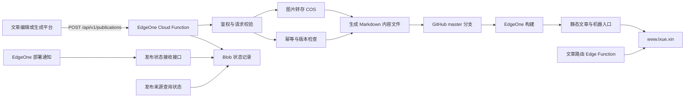
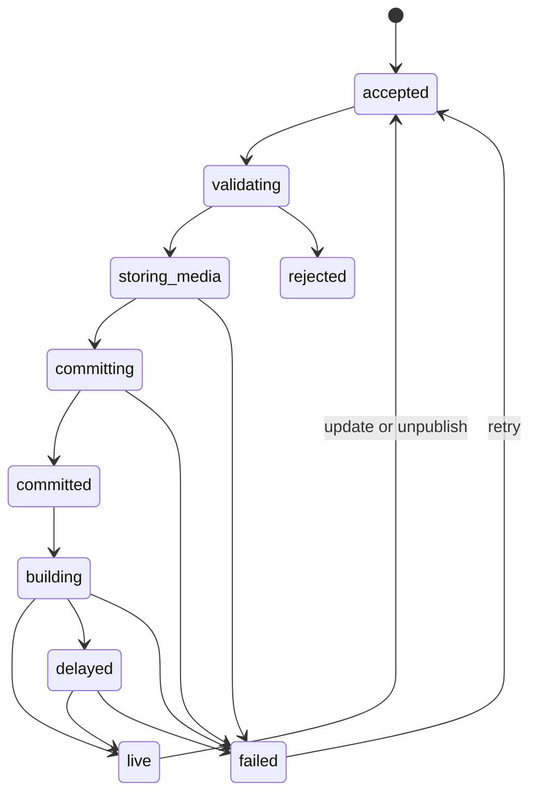

# 零雪AI官网文章自动发布系统设计规范

**状态：** 待用户审阅
**日期：** 2026-07-28
**仓库：** `E:\codex\weijia`
**生产分支：** `master`
**生产域名：** `https://www.lxue.xin`
**设计版本：** 1.0

## 1. 决策摘要

官网采用 Git 原生的无数据库发布架构：

1. EdgeOne Cloud Function 提供版本化发布 API。
2. 发布 API 接收第三方文章平台发送的最终稿，完成鉴权、校验、图片归档和重复请求处理。
3. GitHub 仓库中的 Markdown 文件作为文章唯一数据源。
4. Node.js 静态生成器读取 Markdown，输出文章页、博客列表、站点地图、`llms.txt` 和结构化数据。
5. EdgeOne 监听 `master` 分支，新提交触发生产构建。
6. 腾讯云 COS 保存长期图片，`media.lxue.xin` 提供稳定图片地址。
7. EdgeOne Blob 保存短期发布状态和幂等记录，Git 历史保存长期审计记录。
8. Edge Function 为已改名或撤回的文章返回真实 HTTP 301、410 或 404。

系统保留现有静态多页架构。用户和爬虫从初始 HTML 中读取正文、链接、FAQ 与结构化数据。

## 2. 项目现状

截至 2026-07-28，官网具有以下特征：

- GitHub 公开仓库 `kudisengjie/weijia` 的默认分支为 `master`。
- EdgeOne Pages 托管生产站点，推送生产分支后执行部署。
- 仓库包含 32 篇 `articles/*.html` 文章。
- 文章 HTML 总体约 590 KB，平均每篇约 18.4 KB。
- 官网图片约 14.5 MB，图片占整站文件体积的大部分。
- `blog/index.html` 维护文章列表。
- `sitemap-articles.xml`、`llms.txt` 和文章页内部推荐区需要随文章更新。
- `admin/server.mjs` 负责爬虫日志管理，不提供文章编辑或发布能力。
- 现有文章已经使用 canonical、Article、FAQPage、BreadcrumbList 和组织作者信息。

现有仓库直接保存最终 HTML。继续手工复制文章页面会产生四类问题：

- 发布人员需要同时修改文章页、列表、站点地图和机器入口。
- 页面模板修改时，维护人员需要批量改写已有文章。
- 第三方平台无法通过一个稳定接口完成发布。
- 发布失败后缺少统一状态和回滚入口。

## 3. 目标与非目标

### 3.1 目标

1. 受信任的外部系统可以通过一次 HTTP 请求发布最终文章。
2. 发布系统生成可抓取的静态 HTML，保持现有 URL 和页面样式。
3. 系统自动更新博客列表、分类页、近期文章、Sitemap、`llms.txt` 和结构化数据。
4. 同一文章支持修改、撤回和回滚。
5. 重试请求不会产生重复文章。
6. 图片进入官网控制的持久存储，不长期依赖第三方图片源。
7. 发布人员可以查看接收、提交、构建、上线和失败状态。
8. 发布来源可以更换，不影响官网内容格式和部署流程。
9. 当前规模下不新增常驻服务器或 MySQL。
10. 架构可以在不改变外部 API 的前提下启用批量部署。

### 3.2 非目标

第一版不包含以下能力：

- 官网内置所见即所得编辑器。
- AI 写作、改写、翻译或事实核验。
- 评论、会员、付费和协作审批。
- 数据库驱动的动态文章渲染。
- 在公开 GitHub 仓库保存未发布草稿。
- 由官网承担定时发布。文章来源系统在目标时间调用发布 API。
- 通过发布请求直接传输 Base64 大图或视频。
- 同时管理多个网站。

## 4. 设计原则

### 4.1 内容源与展示层分离

Markdown 保存正文和元数据。模板负责网页结构与视觉。模板改版时，生成器重新构建文章，内容文件不变。

### 4.2 派生文件由构建器生成

文章 HTML、博客列表、Sitemap 和 `llms.txt` 都属于派生文件。发布 API 只写文章源文件，避免一次发布产生多次 Git 提交。

### 4.3 正式上线需要线上确认

发布网关完成校验、图片归档和 Git 提交后返回 `202 Accepted`，响应状态为 `committed`。系统只有在生产地址出现对应发布版本标识后，才把状态改为 `live`。

### 4.4 URL 保持稳定

`article_id` 和首次发布的 `slug` 组成文章身份。系统默认禁止修改已发布文章的 `slug`。确需改名时，生成器把旧地址写入文章路由表，由 Edge Function 返回 HTTP 301。

### 4.5 外部平台只负责提交最终稿

Dify、Coze、n8n、自建工具或其他内容系统都通过同一接口提交。官网内部不保存这些平台的草稿状态。

## 5. 总体架构



### 5.1 组件边界

| 组件 | 职责 | 不承担的职责 |
|---|---|---|
| 发布来源 | 编辑文章、确认最终稿、发起发布 | 生成官网 HTML、保管 GitHub 凭据 |
| 发布网关 | 鉴权、校验、图片归档、写 Git、返回状态 | 写作、页面渲染 |
| 内容仓库 | 保存 Markdown、分类和作者配置 | 保存密钥、保存未发布草稿 |
| 静态生成器 | 将内容转换为网站文件并执行一致性检查 | 接收公网发布请求 |
| EdgeOne | 运行函数、构建并发布站点 | 保存文章的唯一版本 |
| 文章路由函数 | 为旧 slug、撤回文章和未知文章返回 301、410 或 404 | 渲染正常文章 |
| COS | 长期保存图片和附件 | 保存文章正文 |
| Blob 状态存储 | 保存 30 天内的发布状态和幂等缓存 | 代替 Git 历史 |

## 6. 技术选择

### 6.1 发布网关使用 Cloud Function

发布接口位于 `cloud-functions/api`。Cloud Function 使用 Node.js 20 运行时。

选择 Cloud Function 的原因：

- 发布过程需要访问 GitHub 和 COS。
- Node.js 运行时可以使用完整 npm 生态。
- 单次请求体上限为 6 MB。
- 函数最长可以运行 120 秒，适合图片归档和外部 API 重试。
- 发布属于低频后台任务，对边缘毫秒级延迟没有要求。

Edge Function 的 1 MB 请求体和 200 ms CPU 时间适合轻量接口。发布流程加入图片、签名和 Git 操作后，Cloud Function 留出的执行空间更合适。

参考：

- [EdgeOne Makers Cloud Functions](https://pages.edgeone.ai/document/cloud-functions)
- [EdgeOne Makers Node Functions](https://pages.edgeone.ai/document/node-functions)

### 6.2 内容使用 Markdown 与 Front Matter

每篇文章使用一个文件：

```text
content/articles/{article_id}.md
```

文件路径使用稳定的 `article_id`，不使用可修改的标题或 slug。

### 6.3 静态生成器使用 Node.js

生成器保留现有 HTML、CSS 和 JavaScript 架构，不引入客户端单页路由。构建命令统一为：

```text
npm run build
```

EdgeOne 部署目录统一为：

```text
dist/
```

生成器把现有非文章页面和静态资源复制到 `dist/`，再生成所有文章与内容索引。

### 6.4 图片使用 COS

生产图片使用腾讯云 COS 标准存储。官网通过 `media.lxue.xin` 引用图片。文章数据只保存媒体 ID、尺寸、替代文本和自有域名 URL。

Cloud Function 不使用本地文件系统保存长期文件。EdgeOne 官方也建议文件传输场景使用 COS 持久化。

### 6.5 发布状态使用 Blob

Cloud Function 使用 EdgeOne Blob 保存：

- 请求状态；
- 幂等结果缓存；
- 部署事件；
- 失败原因摘要；
- 30 天内的操作时间线。

Git 提交保存长期内容审计。Blob 记录到期后可以删除。

### 6.6 旧地址与撤回地址使用 Edge Function

正常文章拥有对应静态文件，EdgeOne 优先返回静态资源。旧 slug 和撤回文章不生成静态文章文件，请求落到文章路由 Edge Function。函数读取构建时生成的路由表并返回：

- 旧 slug：HTTP 301 和新地址；
- 撤回 slug：HTTP 410；
- 未知 slug：HTTP 404。

该函数不参与正常文章渲染。

## 7. 建议仓库结构

```text
weijia/
├─ cloud-functions/
│  └─ api/
│     └─ v1/
├─ edge-functions/
│  └─ articles/
│     └─ [[default]].js
│        ├─ publications/
│        │  ├─ index.js
│        │  └─ [requestId].js
│        └─ deployment-events.js
├─ content/
│  ├─ articles/
│  │  └─ {article_id}.md
│  ├─ authors.json
│  └─ categories.json
├─ src/
│  ├─ templates/
│  │  ├─ article.html
│  │  ├─ blog-index.html
│  │  ├─ category.html
│  │  └─ redirect.html
│  └─ content/
│     ├─ parse.js
│     ├─ validate.js
│     ├─ render.js
│     └─ indexes.js
├─ tools/
│  ├─ migrate-existing-articles.mjs
│  ├─ build-site.mjs
│  └─ validate-generated-site.mjs
├─ dist/
├─ package.json
└─ edgeone.json
```

`dist/` 属于构建结果，不作为文章源。仓库可以忽略本地 `dist/`，EdgeOne 在每次部署中重新生成。

## 8. 发布 API

### 8.1 接口列表

| 方法 | 路径 | 用途 |
|---|---|---|
| `POST` | `/api/v1/publications` | 发布、修改或撤回文章 |
| `GET` | `/api/v1/publications/{request_id}` | 查询发布状态 |
| `POST` | `/api/v1/deployment-events` | 接收 EdgeOne 部署事件 |

API 使用 `/v1/` 版本前缀。以后增加字段时保持兼容；破坏性变更使用 `/v2/`。

### 8.2 请求头

发布来源发送以下请求头：

```text
Content-Type: application/json
X-Publisher-Id: publisher_name
X-Timestamp: 1785254400
X-Nonce: 4e7f3d1a...
Idempotency-Key: publisher-article-20260728-001
X-Signature: v1=<hex-hmac-sha256>
```

签名原文：

```text
{timestamp}.{nonce}.{raw_request_body}
```

系统按 `X-Publisher-Id` 选择对应密钥。时间戳与服务器时间相差超过 300 秒时，系统拒绝请求。

`Idempotency-Key` 在同一发布来源内保持唯一。相同 Key 与相同请求体返回第一次处理结果；相同 Key 与不同请求体返回冲突。

### 8.3 请求体

```json
{
  "schema_version": 1,
  "event_id": "evt_20260728_000001",
  "action": "publish",
  "article": {
    "article_id": "art_geo_20260728_001",
    "external_id": "source-98765",
    "title": "文章标题",
    "slug": "article-slug",
    "summary": "文章摘要",
    "description": "搜索结果使用的页面描述",
    "category": "geo-guide",
    "tags": ["GEO", "AI搜索"],
    "author_id": "lingxue-ai",
    "content_markdown": "# 正文标题\n\n正文内容",
    "cover_image": {
      "source_url": "https://source.example/image.webp",
      "alt": "图片替代文本"
    },
    "inline_images": [],
    "faq": [],
    "published_at": "2026-07-28T20:00:00+08:00",
    "updated_at": "2026-07-28T20:00:00+08:00",
    "ai_assisted": true
  }
}
```

### 8.4 动作定义

| `action` | 行为 |
|---|---|
| `publish` | 创建新文章。`article_id` 不得已经存在 |
| `update` | 更新已有文章。`article_id` 必须存在 |
| `unpublish` | 从公开索引移除文章并生成撤回结果 |

`unpublish` 请求只要求 `article_id`、`external_id`、`updated_at` 和撤回原因。系统不接受物理删除操作。

### 8.5 字段约束

| 字段 | 约束 |
|---|---|
| `article_id` | 3 至 80 个字母、数字、下划线或短横线；首次发布后不可修改 |
| `external_id` | 1 至 120 个字符；同一发布来源内唯一 |
| `title` | 5 至 100 个可见字符 |
| `slug` | 3 至 120 个小写字母、数字和短横线；首次发布后默认不可修改 |
| `summary` | 20 至 300 个可见字符 |
| `description` | 40 至 200 个可见字符 |
| `category` | 必须存在于 `content/categories.json` |
| `tags` | 最多 10 个；每个不超过 30 个字符 |
| `content_markdown` | 500 至 100,000 个字符 |
| `faq` | 最多 12 组；问题不超过 200 字，答案不超过 2,000 字 |
| `inline_images` | 最多 20 张 |
| `published_at` | 不允许晚于服务器当前时间 10 分钟 |

未来发布时间由文章来源系统保管。来源系统到达目标时间后调用 `publish`。

### 8.6 响应

接收成功：

```json
{
  "request_id": "pub_01J...",
  "event_id": "evt_20260728_000001",
  "article_id": "art_geo_20260728_001",
  "state": "committed",
  "commit_sha": "8e4f...",
  "target_url": "https://www.lxue.xin/articles/article-slug.html",
  "status_url": "https://www.lxue.xin/api/v1/publications/pub_01J..."
}
```

HTTP 状态码为 `202`。网关返回前已经完成校验、图片归档和 Git 提交。`committed` 表示 EdgeOne 部署尚未完成，不能视为文章已经上线。

## 9. 发布状态机



### 9.1 状态含义

| 状态 | 含义 |
|---|---|
| `accepted` | 网关已经接收请求 |
| `validating` | 系统正在校验签名、字段和文章版本 |
| `storing_media` | 系统正在归档图片 |
| `committing` | 系统正在写入 GitHub |
| `committed` | Git 提交成功，EdgeOne 尚未确认开始构建 |
| `building` | EdgeOne 已创建部署 |
| `delayed` | 构建超过 15 分钟，系统继续等待最终结果 |
| `live` | 生产 URL 已出现对应发布版本 |
| `rejected` | 请求格式、权限或内容不符合规则 |
| `failed` | 图片、GitHub 或部署过程失败 |

### 9.2 上线确认

生成器在文章页加入：

`accepted`、`validating`、`storing_media` 和 `committing` 是网关请求执行期间的内部状态。发布接口在进入 `committed` 后返回响应。校验、图片或 Git 操作失败时，接口返回对应非 2xx 错误，不依赖函数返回后的后台任务。

```html
<meta name="publication-id" content="evt_20260728_000001">
```

EdgeOne 的 `deployment.created`、`deployment.succeeded` 和 `deployment.failed` 事件发送到 `/api/v1/deployment-events`。状态服务记录部署事件。

状态查询接口还会检查目标 URL 中的 `publication-id`。部署通知缺失时，线上标识作为回退确认方式。

## 10. 内容模型

### 10.1 Markdown 文件示例

```markdown
---
schema_version: 1
article_id: art_geo_20260728_001
external_id: source-98765
last_event_id: evt_20260728_000001
title: 文章标题
slug: article-slug
summary: 文章摘要
description: 页面描述
category: geo-guide
tags:
  - GEO
  - AI搜索
author_id: lingxue-ai
status: published
published_at: 2026-07-28T20:00:00+08:00
updated_at: 2026-07-28T20:00:00+08:00
ai_assisted: true
cover_image:
  url: https://media.lxue.xin/articles/art_geo_20260728_001/cover.webp
  alt: 图片替代文本
  width: 1280
  height: 720
faq:
  - question: 常见问题
    answer: 对应答案
---

## 正文章节

正文内容。
```

### 10.2 字段所有权

| 字段 | 所有者 |
|---|---|
| 标题、摘要、正文、FAQ | 发布来源 |
| `article_id`、`external_id` | 发布来源与网关共同校验 |
| 图片最终 URL、尺寸、哈希 | 发布网关 |
| canonical、结构化数据、相关推荐 | 静态生成器 |
| Git 提交 SHA、部署状态 | 发布网关与 EdgeOne |

### 10.3 内容安全

生成器处理 Markdown 时执行以下规则：

- 转义原始 HTML，或按白名单保留允许标签。
- 拒绝 `script`、内联事件、`javascript:` URL 和嵌入式表单。
- 外部链接增加安全属性。
- 标题层级从正文 `h2` 开始。页面模板生成唯一 `h1`。正文中的 Markdown 一级标题会导致校验失败。
- 图片必须使用 HTTPS 和允许的自有媒体域名。
- FAQ 可见文本和 FAQPage JSON-LD 使用同一数据源。

## 11. 静态生成规则

### 11.1 文章页

每篇已发布文章输出：

```text
dist/articles/{slug}.html
```

文章页必须包含：

- 唯一 `title`、description、canonical 和 `h1`；
- `article:published_time` 与 `article:modified_time`；
- Article、BreadcrumbList 和匹配可见内容的 FAQPage；
- 作者与发布者 Organization；
- 可见的发布时间、修改时间、分类和标签；
- Markdown 正文、目录和标题锚点；
- 图片尺寸、`alt` 和延迟加载属性；
- 近期文章与相关推荐；
- `publication-id`；
- 无 JavaScript 时仍可读取的正文与链接。

### 11.2 博客列表

生成器按 `published_at` 倒序输出博客列表。

- 每页 12 篇文章。
- 第一页保持 `/blog/`。
- 后续页使用 `/blog/page/2/`、`/blog/page/3/`。
- 分类页使用 `/blog/category/{category}/`。
- 每页输出真实上一页和下一页链接。
- 标题、日期、分类和文章链接存在于初始 HTML。

### 11.3 Sitemap

生成器更新：

- `sitemap.xml`；
- `sitemap-articles.xml`。

文章 `lastmod` 使用 `updated_at`。撤回文章从 Sitemap 删除。系统不使用构建时间批量覆盖所有 `lastmod`。

### 11.4 `llms.txt`

生成器从已发布文章生成机器可读索引，包含：

- 标题；
- 正式 URL；
- 摘要或重点问句；
- 分类；
-更新时间。

撤回文章不出现在 `llms.txt`。

### 11.5 推荐文章

生成器按分类和标签计算推荐文章：

1. 同分类优先。
2. 标签重合数量决定次序。
3. 排除当前文章。
4. 最多输出 6 篇。
5. 分数相同时，最近更新的文章优先。

算法保持确定性，相同内容输入必须生成相同结果。

### 11.6 文章路由表

生成器输出旧 slug 和撤回 slug 的路由表，并把它打包进文章路由 Edge Function。正常文章路径存在静态文件，不进入函数。路由表中的旧 slug 返回 301，撤回 slug 返回 410，其余缺失路径返回 404。

## 12. 图片流程

### 12.1 输入规则

发布请求只传远程 HTTPS URL 和替代文本，不传 Base64。

每张源图必须满足：

- MIME 为 JPEG、PNG 或 WebP；
- 单图不超过 5 MB；
- 单篇最多 20 张；
- 下载超时 10 秒；
- 禁止内网 IP、环回地址和云元数据地址；
- 重定向最多 3 次；
- 文件扩展名不能代替 MIME 检查。

这些规则防止 SSRF、超大文件和伪造图片。

### 12.2 归档规则

系统按以下路径保存图片：

```text
articles/{article_id}/{content_hash}-{width}.webp
```

图片处理输出：

- 最大宽度 1280px 的正文图；
- 640px 响应式版本；
- WebP 格式；
- 宽高信息；
- 内容哈希。

同一图片哈希已经存在时，系统复用现有文件。

### 12.3 发布原子性

任何必需图片归档失败时，系统不提交文章。旧文章版本继续在线。更新文章时，新图片归档成功后才替换内容引用。

未被文章引用的临时图片保留 7 天，清理任务随后删除。

## 13. GitHub 写入流程

### 13.1 写入权限

发布网关使用专用 GitHub App：

- 只安装到 `kudisengjie/weijia`；
- 只申请 Contents 写权限和 Metadata 读权限；
- 运行时生成短期安装令牌；
- 不使用个人账号密码；
- 不向发布来源暴露 GitHub 凭据。

GitHub App 私钥保存在 EdgeOne 密钥配置中。若单个变量存在长度限制，部署配置将私钥拆分为多个密钥片段，函数只在内存中组合。

### 13.2 原子提交

网关使用 Git Data API 完成一次提交：

1. 读取 `master` 最新提交和树。
2. 创建文章 Markdown Blob。
3. 基于最新树创建新树。
4. 创建提交。
5. 使用非强制方式更新 `master` 引用。

引用更新发生冲突时，网关重新读取分支并重试，最多 3 次。网关不使用强制推送。

### 13.3 幂等

文章 Markdown 的 `last_event_id` 保存最近一次成功事件。重试时：

- `event_id` 与内容哈希都相同，返回原结果；
- `event_id` 相同但内容哈希不同，返回 `409 Conflict`；
- `event_id` 不同且 `action=update`，创建新版本；
- `event_id` 不同且 `action=publish`，但文章已存在，返回 `409 Conflict`。

内容哈希使用规范化文章对象计算 SHA-256。规范化过程按字段名排序、统一正文换行为 LF，并排除请求时间戳、nonce 和签名。

Git 文件和 `last_event_id` 是幂等判断的最终依据。Blob 缓存用于减少 GitHub 查询。

## 14. 鉴权与防护

### 14.1 发布来源密钥

每个发布来源拥有独立的 `publisher_id` 和 HMAC 密钥。停用某个平台时，只撤销对应密钥。

### 14.2 请求防护

- 验证 HMAC-SHA256。
- 使用恒定时间比较签名。
- 拒绝过期时间戳。
- 记录并拒绝重复 nonce。
- 要求 `Idempotency-Key`。
- 限制请求体为 1 MB，低于 Cloud Function 的平台上限。
- 每个发布来源每分钟最多 30 个写请求。
- EdgeOne 精确限流规则限制异常 IP。
- CORS 不开放给任意浏览器来源。

### 14.3 密钥管理

- 发布密钥、GitHub App 凭据和 COS 凭据不进入 Git。
- 生产与预览环境使用不同密钥。
- 发布来源密钥每 180 天轮换。
- 发生疑似泄露时，管理员立即停用对应来源并更换密钥。
- 日志只记录 `publisher_id`、请求 ID 和签名校验结果。

## 15. 修改、撤回与回滚

### 15.1 修改

`update` 保留：

- `article_id`；
- 首次发布日期；
- 默认 slug；
- Git 历史。

系统更新 `updated_at`、正文、图片、FAQ 和派生索引。

### 15.2 slug 变更

调用方需要显式传入 `allow_slug_change: true`。网关记录旧 slug。生成器把旧地址写入文章路由表，Edge Function 返回 HTTP 301，新地址成为 canonical。

### 15.3 撤回

`unpublish` 将状态改为 `archived`：

- 文章退出博客、分类、推荐、Sitemap 和 `llms.txt`；
- 生成器不再输出原文章文件，文章路由 Edge Function 为原 URL 返回 HTTP 410；
- 撤回原因保存在内容元数据和 Git 提交说明；
- Git 历史继续保留已公开内容。

需要转移权重时，调用方可以提供 `redirect_to`。生成器校验目标属于官网后输出 301。

### 15.4 回滚

管理员通过 Git 回滚错误提交。EdgeOne 构建回滚后的分支。发布状态记录新的回滚请求 ID，不覆盖原事件。

## 16. 部署与容量控制

### 16.1 直接部署模式

第一版每次成功写入 `master` 触发一次 EdgeOne 构建。EdgeOne 官方文档说明，关联 Git 仓库后，生产分支的新提交会触发部署。

参考：

- [EdgeOne Makers Deployment Overview](https://pages.edgeone.ai/document/deployment-overview)
- [Importing a Git Repository](https://pages.edgeone.ai/document/importing-a-git-repository)

### 16.2 构建消耗

月构建次数按以下公式统计：

```text
B = 新文章发布 + 文章修改 + 撤回 + 重试提交 + 官网代码发布
```

当前 EdgeOne Makers 免费版提供每月 500 次构建。系统设置以下运营阈值：

| 使用量 | 处理 |
|---:|---|
| 300 次/月 | 后台告警，检查重复更新和失败重试 |
| 400 次/月 | 启用批量发布模式 |
| 450 次/月 | 暂停非必要自动重试，人工确认后发布 |

参考：[EdgeOne Makers Limits and Quotas](https://pages.edgeone.ai/document/limits-and-quotas)

### 16.3 批量发布模式

批量模式保持外部 API 不变。网关把文章提交到内容接收分支，系统按以下任一条件合并到 `master`：

- 等待 5 分钟；
- 待发布文章达到 10 篇；
- 管理员发起立即发布。

一次合并只触发一次生产构建。批量模式作为容量升级方案，不纳入第一版开发范围。

## 17. 发布通知与状态查询

EdgeOne 消息通知订阅以下事件：

- `deployment.created`；
- `deployment.succeeded`；
- `deployment.failed`。

EdgeOne 把事件发送到 `/api/v1/deployment-events`。接收接口验证 Bearer Token，并按分支、提交或部署标识关联发布请求。

EdgeOne 对非 2xx 通知最多重试 3 次。状态接口对重复部署事件执行幂等更新。

参考：[EdgeOne Makers Message Notification](https://pages.edgeone.ai/document/notification)

发布来源可以轮询状态接口。建议间隔：

```text
5 秒、10 秒、20 秒、30 秒，之后每 60 秒一次
```

轮询达到 15 分钟仍未上线时，状态返回 `delayed` 并提示检查部署。达到 25 分钟且部署事件没有成功记录时，状态返回 `failed`，错误类型为 `deployment_timeout`。

## 18. 错误模型

### 18.1 错误响应

```json
{
  "request_id": "pub_01J...",
  "error": {
    "code": "invalid_signature",
    "message": "请求签名无效",
    "retryable": false
  }
}
```

### 18.2 错误分类

| HTTP | 错误码 | 是否重试 |
|---:|---|---|
| 400 | `invalid_json`、`invalid_article` | 否 |
| 401 | `invalid_signature`、`expired_timestamp` | 否 |
| 403 | `publisher_disabled`、`source_ip_denied` | 否 |
| 409 | `idempotency_conflict`、`article_exists`、`version_conflict` | 人工确认 |
| 413 | `payload_too_large`、`image_too_large` | 修改内容后重试 |
| 422 | `media_validation_failed`、`unsafe_content` | 修改内容后重试 |
| 429 | `rate_limited` | 按 `Retry-After` 重试 |
| 502 | `github_unavailable`、`cos_unavailable` | 是 |
| 504 | `deployment_timeout` | 查询状态后决定 |

### 18.3 重试

网关只对外部临时故障重试：

- GitHub 409 或 5xx：最多 3 次；
- COS 5xx：最多 2 次；
- 每次使用指数退避和随机抖动；
- 请求校验错误不重试。

## 19. 迁移现有 32 篇文章

### 19.1 迁移目标

所有现有文章进入统一 Markdown 模型。迁移不得改变：

- 正式 URL；
- 标题与正文语义；
- canonical；
- 发布与修改日期；
- FAQ；
- 站内有效链接；
- 现有结构化数据事实。

### 19.2 迁移步骤

1. 记录迁移前稳定 Git 提交。
2. 从现有 HTML 提取标题、摘要、正文、分类、日期、FAQ 和图片。
3. 生成 32 个 Markdown 文件。
4. 生成器在临时目录输出文章和索引。
5. 对比旧版与新版 URL、标题、正文、链接和 JSON-LD。
6. 使用本地预览检查桌面端和移动端。
7. 在 EdgeOne 预览环境部署。
8. 抽查 5 篇不同结构的文章。
9. 通过全部校验后切换生产构建目录。

### 19.3 双轨限制

迁移完成后，维护人员不得继续手工创建 `articles/*.html`。生成器发现没有内容源的手写文章时，构建失败并列出文件名。

## 20. 日志、审计与告警

### 20.1 结构化日志

每条日志包含：

- `request_id`；
- `event_id`；
- `publisher_id`；
- `article_id`；
- 当前状态；
- Git 提交 SHA；
- EdgeOne 部署标识；
- 耗时；
- 错误码。

日志不包含正文、完整图片 URL 查询参数、签名和密钥。

### 20.2 审计

Git 提交信息格式：

```text
content(article_id): publish|update|unpublish title
```

提交说明记录：

- 请求 ID；
- 发布来源；
- 外部文章 ID；
- 动作；
- 内容哈希。

### 20.3 告警

以下事件发送邮件或控制台通知：

- 部署失败；
- 15 分钟未上线；
- 连续 5 次鉴权失败；
- GitHub 或 COS 连续 3 次临时故障；
- 月构建次数达到 300 和 400；
- COS 存储达到预算阈值。

## 21. 费用模型

### 21.1 EdgeOne

```text
构建消耗 = 发布 + 修改 + 撤回 + 重试提交 + 代码发布
函数调用 = 发布请求 + 状态查询 + 部署通知 + 媒体处理请求
项目空间 = 静态页面 + CSS/JS + 非 COS 静态资源
```

当前免费额度包括每月 500 次构建、100 万次 Cloud Function 执行、5 GB 项目空间和 1 GB Blob。官方尚未公布商业版固定超额单价，额度不足时需要提交工单。

### 21.2 COS

```text
月 COS 费用
= 平均存储 GB × 存储单价
+ 读写请求数 ÷ 10,000 × 请求单价
+ 回源或下行 GB × 流量单价
```

图片经过压缩和 CDN 缓存后，存储与回源量保持可控。

参考：

- [COS 按量计费](https://cloud.tencent.com/document/product/436/36522)
- [COS 请求费用](https://cloud.tencent.com/document/product/436/53861)

### 21.3 GitHub

GitHub API 调用不按单次收费，但受速率限制。当前发布量远低于认证 API 每小时额度。GitHub 仓库保持公开时，标准 GitHub Actions 运行器可作为未来批量构建备选。

### 21.4 AI

发布网关不调用大模型，因此发布过程的 AI Token 消耗为 0。文章来源平台产生的模型费用按对应供应商计算：

```text
AI 月费用
= 输入 Token ÷ 1,000,000 × 输入单价
+ 输出 Token ÷ 1,000,000 × 输出单价
```

## 22. 测试策略

### 22.1 单元测试

- HMAC 签名和恒定时间比较；
- 时间戳、nonce 和幂等键；
- API 字段校验；
- slug 和 article ID；
- Markdown 安全处理；
- 推荐文章排序；
- Sitemap 与 `lastmod`；
- Git 冲突重试；
- 图片 URL 与 SSRF 防护。

### 22.2 集成测试

- 发布网关到 GitHub 测试分支；
- 图片转存到测试 COS；
- EdgeOne 预览部署；
- EdgeOne 部署通知到状态接口；
- `publish`、`update`、`unpublish` 全流程；
- 重复请求和并发请求；
- GitHub、COS 与 EdgeOne 故障模拟。

### 22.3 内容回归

- 32 篇现有文章 URL 全部返回 200；
- 标题、canonical、日期和正文一致；
- 站内链接无 404；
- JSON-LD 可以解析；
- FAQ 可见内容和 FAQPage 一致；
- 博客分页和分类入口完整；
- Sitemap、`llms.txt`、robots 和 URLs 一致；
- 无 JavaScript 时正文可读。

### 22.4 浏览器与抓取测试

- Chrome、Edge、Safari 和 Firefox 当前稳定版；
- 375px、768px、1024px 和 1440px；
- 移动端图片尺寸与布局偏移；
- 搜索爬虫与 AI 爬虫抓取初始 HTML；
- 文章发布后目标 URL 的 `publication-id` 匹配。

## 23. 验收标准

系统满足以下全部条件后才能进入生产：

1. 受信任来源可以通过一次 API 请求发布文章。
2. 相同幂等键重试不会产生第二篇文章或第二次内容变更。
3. 新文章上线后自动进入博客、分类、Sitemap 和 `llms.txt`。
4. 文章页包含可解析的 Article、BreadcrumbList 和匹配可见 FAQ 的 FAQPage。
5. 发布接口在文章上线前不返回 `live`。
6. 图片全部使用 `media.lxue.xin`，第三方图片源下线不影响文章。
7. 文章修改保留 URL 和首次发布日期。
8. 撤回文章退出所有公开索引，原 URL 返回 410 或明确的 301。
9. 部署失败时旧站继续在线。
10. Git 可以回滚任何一次发布。
11. 32 篇旧文章迁移后 URL、正文和结构化数据通过回归检查。
12. 密钥、Token 和正文不会出现在运行日志。
13. 生产分支没有手写且缺少内容源的文章 HTML。
14. 构建次数与函数调用量可以从控制台或日志统计。

## 24. 分阶段交付

### 阶段 1：内容模型与静态生成

- 建立 Markdown 模型。
- 迁移 32 篇文章。
- 生成文章页、博客分页、分类、Sitemap 和 `llms.txt`。
- 完成内容一致性测试。

### 阶段 2：发布网关

- 建立版本化 API。
- 完成 HMAC、幂等、Git 写入和状态接口。
- 配置 GitHub App。
- 在测试分支验证完整流程。

### 阶段 3：图片与部署状态

- 配置 COS 与 `media.lxue.xin`。
- 完成图片归档和安全校验。
- 接入 EdgeOne 部署通知。
- 完成上线确认和错误告警。

### 阶段 4：生产切换

- 部署 EdgeOne 预览环境。
- 执行旧文章回归。
- 切换生产构建目录。
- 发布一篇试运行文章。
- 观察 48 小时后开放正式发布来源。

## 25. 风险与控制

| 风险 | 控制 |
|---|---|
| 第三方重复发送 | HMAC、nonce、幂等键和 `last_event_id` |
| 并发 Git 提交冲突 | 非强制更新引用，基于新分支头最多重试 3 次 |
| 发布了危险 HTML | Markdown 渲染和标签白名单 |
| 图片源失效 | 发布前转存 COS |
| 图片下载触发 SSRF | DNS/IP 检查、协议限制和重定向限制 |
| EdgeOne 构建失败 | 旧部署继续服务，状态标记失败 |
| 月构建次数接近额度 | 300 次告警，400 次启用批量发布 |
| 公开仓库泄露草稿 | 仓库只接收最终稿，不保存草稿 |
| GitHub 凭据泄露 | GitHub App 最小权限和短期令牌 |
| slug 变化损失权重 | 默认不可修改，显式变更时生成旧地址跳转 |
| 模板升级影响旧文章 | 所有文章共用内容模型和回归测试 |

## 26. 完成定义

本设计阶段在以下条件满足后结束：

1. 用户确认本规范中的架构、接口、内容模型和操作规则。
2. 文档不存在待定字段、占位符和互相矛盾的要求。
3. 下一步实施计划可以从本文逐项拆分任务和测试。

用户批准本文后，项目进入实施计划编写阶段。编写计划不等于开始开发；用户可以在计划审阅后再次决定是否执行。
