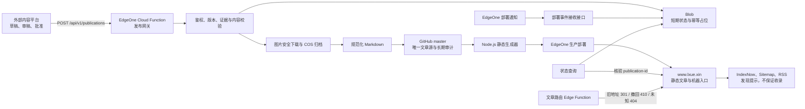
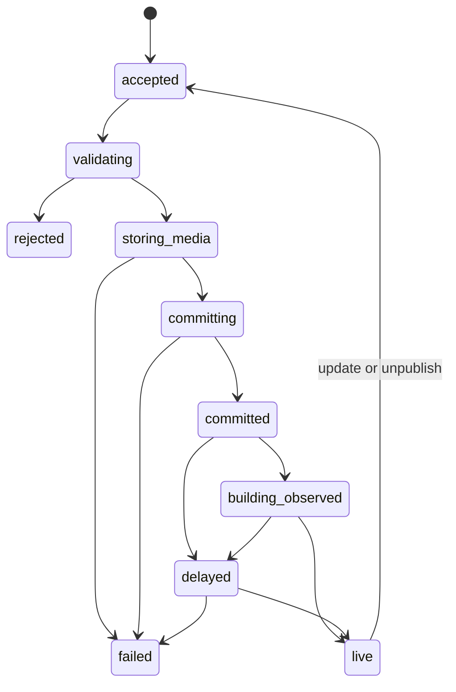

# 零雪AI官网文章自动发布与 GEO 内容治理系统设计规范

**状态：** 待用户审阅
**日期：** 2026-07-28
**设计版本：** 2.0（复审版）
**适用仓库：** `E:\codex\weijia`
**生产分支：** `master`
**生产域名：** `https://www.lxue.xin`
**核验基准：** EdgeOne、GitHub、Google、Schema.org、Bing、OWASP 与腾讯云官方资料，核验日期为 2026-07-28

> 本文只定义方案、操作规则、成本口径和验收标准，不授权开发、部署、创建云资源或修改生产配置。

## 1. 审核结论

### 1.1 最终建议

保留 V1 的主架构：

- EdgeOne Cloud Function 接收发布请求；
- GitHub 中的 Markdown 保存文章源；
- Node.js 生成静态 HTML 和内容索引；
- EdgeOne 监听 `master` 并部署；
- 腾讯云 COS 保存文章图片；
- EdgeOne Blob 保存短期状态；
- Edge Function 处理旧地址、撤回地址和未知文章。

该架构适合当前官网，因为现站是静态多页网站，文章数量少，已有 Git 与 EdgeOne 部署链路，编辑工作发生在外部内容平台。它能在不新增常驻服务器和数据库的条件下提供稳定的发布 API。

本方案的批准结论为“附条件通过”。正式开发前必须先完成第 7 节的阶段 0 验证。任何关键验证失败时，团队应采用文中指定的降级路径，不得绕过验证直接上线。

### 1.2 V1 必须修正的问题

| 级别 | 问题 | V2 处理 |
|---|---|---|
| P0 | EdgeOne 部署通知示例不含 Git commit SHA，不能准确证明某篇文章已上线 | 部署通知只作辅助状态；生产响应中的当前事件与内容版本才能把请求标为 `live` |
| P0 | 自动发布只校验字段与 HTML 安全，无法阻止无来源的固定比例、固定权重和“官方标准”等断言 | 增加来源、主张映射、人工批准和内容风险门禁 |
| P0 | Blob 默认最终一致，直接用于状态机和 nonce 判断会出现短暂旧读 | 状态与幂等读取使用强一致；首次占位使用 `onlyIfNew` |
| P0 | `update` 没有文章版本前置条件，并发更新可能覆盖较新的内容 | `update` 与 `unpublish` 必须提交 `expected_content_version` |
| P1 | GitHub App 私钥超过 EdgeOne 单个环境变量 500 字节限制，V1 只描述拆分，没有轮换和启动校验 | 定义分片格式、启动指纹校验、双密钥轮换和密钥库迁移条件 |
| P1 | 单篇 20 张、每张 5 MB 的图片处理上限与 120 秒函数时限缺少联合约束 | 第一版限制为最多 12 张、源文件合计不超过 30 MB，并限制并发、像素和总耗时 |
| P1 | FAQPage 被当作文章固定输出 | 只有页面存在真实可见问答时才输出；不承诺 Google FAQ 富结果 |
| P1 | `llms.txt` 被描述为稳定机器入口 | 保留为实验性辅助文件，不替代 HTML、Sitemap 或 robots.txt，不承诺平台采用 |
| P1 | Sitemap 没有明确排除无效 `changefreq` 与 `priority` 维护 | 新生成器只输出 canonical URL 和真实 `lastmod` |
| P1 | 迁移要求保留全部“事实”，会固化现有弱证据内容 | 迁移前将文章分为可迁移、需修订、应撤回三类 |
| P2 | 成本公式把没有推进 `master` 的 Git 重试也算成构建 | 只有生产分支成功前进或人工重部署才计一次构建 |
| P2 | Cloud Function 调用公式把同一请求内的图片处理重复计次 | 图片处理影响执行时长和内存，不单独增加函数调用次数 |

## 2. 多轮审核记录

| 轮次 | 审核范围 | 结论 | 已写入的改进 |
|---:|---|---|---|
| 1 | 技术可行性与一致性 | 架构可行，状态关联、并发更新和运行时边界需要修正 | 阶段 0、强一致状态、版本锁、线上标识确认 |
| 2 | GEO、SEO 与内容输出 | 技术标记较完整，事实来源、作者责任和内容独特性控制不足 | 内容批准门禁、引用模型、编辑与纠错政策、RSS、IndexNow |
| 3 | 安全与故障恢复 | HMAC 方向正确，媒体 SSRF、密钥保存、日志和恢复演练需要加强 | 媒体域名白名单、逐跳 DNS 校验、密钥轮换、COS 版本控制 |
| 4 | 成本、容量与长期运维 | 当前规模可进入免费额度，构建次数是首个容量瓶颈 | 新成本公式、阈值、批量模式和迁移触发条件 |
| 5 | 反向审查 | EdgeOne 相关能力较新，部分运行时行为必须实测；自动发布会放大内容错误 | 阶段 0 一票否决、适配器边界、人工批准终稿、质量失败时关闭发布 |

## 3. 当前官网基线

### 3.1 本地仓库事实

截至 2026-07-28：

- `articles/` 中有 32 篇静态 HTML，合计约 590 KB；
- 32 篇都包含 Article 或 BlogPosting 与 BreadcrumbList；
- 20 篇包含 FAQPage；
- 32 篇 Article JSON-LD 均未提供文章图片；
- 只有 2 篇检测到可见的来源或参考资料章节；
- 只有 5 篇文章声明 `max-image-preview:large`；
- `sitemap-articles.xml` 包含 32 个文章 URL；
- `llms.txt` 包含 32 个文章 URL；
- `blog/index.html`、Sitemap、`llms.txt` 和推荐区由人工维护；
- `admin/server.mjs` 用于爬虫日志管理，不提供文章发布能力；
- 根目录尚无统一的 Node.js 静态构建入口。

### 3.2 内容风险样本

现有代表文章包含固定内容比例、平台额外权重和“国家 GEO 标准”等没有可见来源的断言。新系统不能把“格式正确”当成“事实可信”。迁移与新发布都必须经过内容证据门禁。

### 3.3 当前技术优势

- 正文位于初始 HTML；
- 正常文章不依赖客户端 JavaScript 渲染；
- canonical、Article、BreadcrumbList 与 FAQ 已有基础；
- 站点由 Git 管理，错误版本可以回滚；
- EdgeOne 已承担生产部署与域名服务。

## 4. 目标、非目标与成功边界

### 4.1 目标

1. 受信任的外部内容平台可以通过一次 API 请求提交已批准终稿。
2. 新文章、修改和撤回经过同一内容模型与审计链路。
3. 系统生成可抓取、可访问、事实一致的静态 HTML。
4. 博客、分类、Sitemap、RSS、`llms.txt` 和相关推荐由生成器维护。
5. 量化、时效、比较、合规和效果类主张可以追溯到可见来源。
6. 重试不会重复创建文章或覆盖较新的文章版本。
7. 图片保存在官网控制的媒体域名下。
8. 调用方可以区分“已提交”“正在构建”和“已经上线”。
9. 架构在第一版不依赖常驻服务器或关系数据库。
10. EdgeOne、COS 或发布来源更换时，外部 API 与 Markdown 内容可以保留。

### 4.2 非目标

第一版不提供：

- 官网内置富文本编辑器；
- 草稿协作、评论或多人审批界面；
- AI 写作、事实核验模型或自动来源生成；
- 会员、付费和个性化文章；
- 动态数据库渲染；
- 视频与任意附件托管；
- 由官网内部执行定时发布；
- 多站点内容管理；
- 搜索或生成式平台的收录、引用、排名和推荐保证。

### 4.3 成功边界

发布系统负责：

- 验证调用来源；
- 执行确定性的格式、证据和安全门禁；
- 保存媒体和内容；
- 生成规范网页；
- 记录版本与上线状态。

发布系统不能判断每个行业事实是否真实。事实真实性由署名作者、审稿人和发布组织负责。系统通过来源映射、审稿记录和失败关闭机制降低错误进入生产的概率。

## 5. 总体架构



### 5.1 核心数据责任

| 数据 | 长期权威源 | 短期或派生位置 |
|---|---|---|
| 正文与文章元数据 | Git Markdown 与 Git 历史 | 生成后的 HTML |
| 图片二进制 | COS | CDN 缓存 |
| 发布状态 | 30 天 Blob 记录 | 调用方本地状态 |
| 幂等最终结果 | Markdown 中的事件与内容版本 | Blob 缓存 |
| 页面路由 | 文章 Markdown 与生成路由表 | Edge Function 包 |
| 搜索发现文件 | Markdown 派生 | `dist/` 中的 Sitemap、RSS、`llms.txt` |
| 审核责任 | Markdown 中的作者、审稿人和批准记录 | 页面可见署名与更新记录 |

## 6. 组件与信任边界

| 组件 | 可信输入 | 不可信输入 | 主要职责 |
|---|---|---|---|
| 发布来源 | 自身草稿、审稿人与来源记录 | 用户粘贴内容、外部链接 | 形成已批准终稿 |
| 发布网关 | 已配置发布者与密钥 | 全部 HTTP 字段、正文、图片 URL | 鉴权、校验、归档、提交 |
| GitHub | 安装令牌与目标仓库 | 分支头可能被其他提交推进 | 长期版本与审计 |
| 静态生成器 | 通过 schema 的 Markdown | Markdown 正文与链接仍按不可信处理 | 安全渲染与一致性检查 |
| EdgeOne | 受控项目配置 | 公网请求和部署通知 | 运行函数、部署、缓存与防护 |
| COS | 经过验证和重编码的图片 | 源图片与元数据 | 持久媒体 |
| Blob | 规范化状态对象 | 并发请求和重复事件 | 短期状态、nonce 与幂等缓存 |

所有跨边界输入都必须重新校验。发布来源被列为“受信任”只表示它拥有调用权限，不表示它提交的正文、URL 或元数据天然安全。

## 7. 阶段 0：生产同构可行性验证

EdgeOne Cloud Function、Blob 和消息通知都是近一年新增或扩展的能力。正式拆分开发任务前，先用最小代码在预览环境完成以下验证。

### 7.1 必测项目

| 编号 | 验证 | 通过条件 | 失败后的降级路径 |
|---|---|---|---|
| F0-01 | Cloud Function Node.js 20、120 秒配置和公网出站 | 可访问 GitHub API 与 COS，函数在设定时限内返回 | 发布网关迁移到腾讯云 SCF/API 网关，外部 API 不变 |
| F0-02 | 图片模块 | `sharp` 或选定模块可打包、运行、限制像素并输出 WebP | 使用 COS 数据处理或独立媒体函数 |
| F0-03 | GitHub App 私钥 | 分片重组后指纹匹配，能生成 1 小时安装令牌 | 使用外部密钥库或把网关迁到支持密钥库的运行环境 |
| F0-04 | Blob 并发 | 强一致读能读取最新状态，`onlyIfNew` 能阻止同一 nonce 首次占位竞争 | Blob 只保留展示状态，幂等完全回退到 Git 与其他强一致存储 |
| F0-05 | Edge Function 路由 | 正常静态文章返回 200，缺失地址进入 catch-all 并返回真实 301、410、404 | 使用 Middleware 或可维护的 EdgeOne 路由配置 |
| F0-06 | 部署通知真实载荷 | 记录真实 `created/succeeded/failed` 载荷与重试行为 | 通知只保留告警，状态查询完全依赖生产 URL 探测 |
| F0-07 | 旧部署保护 | 新构建失败时生产域名继续返回旧版页面 | 暂停自动发布并调整部署策略 |
| F0-08 | 构建产物 | `dist/`、Cloud Functions 与 Edge Functions 同时被正确部署 | 按 EdgeOne Build Output 规范调整构建器 |

### 7.2 一票否决条件

出现任一情况时，不进入功能开发：

- 无法在目标账号稳定读取强一致状态；
- 原生图片模块在目标运行时无法安全限制解码资源，且 COS 处理降级方案未验证；
- GitHub App 私钥无法安全配置或轮换；
- catch-all 会拦截正常静态文章；
- 构建失败会替换当前生产版本；
- 目标账号控制台显示的实际额度低于本方案所需。

### 7.3 验证输出

阶段 0 形成一份短报告，记录：

- 项目与区域；
- Node.js 和依赖版本；
- 实际通知字段；
- 函数时长、峰值内存和包大小；
- Blob 一致性测试结果；
- 图片样本处理结果；
- 路由状态码；
- Go/No-Go 决策。

## 8. 发布 API 设计

### 8.1 接口

| 方法 | 路径 | 鉴权 | 用途 |
|---|---|---|---|
| `POST` | `/api/v1/publications` | HMAC | 发布、修改或撤回 |
| `GET` | `/api/v1/publications/{request_id}` | HMAC 或独立只读令牌 | 查询状态 |
| `POST` | `/api/v1/deployment-events` | EdgeOne Bearer Token | 接收部署事件 |
| `GET` | `/api/v1/health/live` | 无敏感信息，可由平台探测 | 只证明函数进程可响应 |
| `GET` | `/api/v1/health/ready` | 独立只读令牌与来源限制 | 检查关键配置和依赖 |

API 通过 `/v1/` 保持兼容。新增可选字段不升级主版本；改变字段语义或删除字段时使用 `/v2/`。

### 8.2 请求签名

```text
Content-Type: application/json
X-Publisher-Id: publisher_name
X-Timestamp: 1785254400
X-Nonce: 4e7f3d1a...
Idempotency-Key: publisher-article-20260728-001
X-Signature: v1=<hex-hmac-sha256>
```

签名原文：

```text
v1
{uppercase_http_method}
{canonical_path}
{timestamp}
{nonce}
{sha256_hex(raw_request_body)}
```

规则：

- 使用 HMAC-SHA256；
- 签名覆盖 HTTP 方法、规范化路径和原始请求体哈希；查询状态时不得遗漏路径中的 `request_id`；
- `canonical_path` 只包含规范化路径，不包含域名、fragment 或未经定义的查询参数；
- `GET` 请求的请求体按零字节空串计算 SHA-256；
- 按 `publisher_id` 选择独立密钥；
- 签名使用恒定时间比较；
- 时间偏差不得超过 300 秒；
- nonce 至少 128 位随机值；
- nonce 通过 Blob `onlyIfNew` 抢占，保留 10 分钟；
- 所有写请求必须有 `Idempotency-Key`；
- HMAC 密钥支持当前与下一把密钥并存的轮换窗口。

### 8.3 请求体示例

```json
{
  "schema_version": 2,
  "event_id": "evt_20260728_000001",
  "action": "publish",
  "expected_content_version": null,
  "article": {
    "article_id": "art_geo_20260728_001",
    "external_id": "source-98765",
    "content_kind": "guide",
    "title": "文章标题",
    "slug": "article-slug",
    "summary": "文章摘要",
    "description": "搜索结果使用的页面描述",
    "primary_question": "本文帮助读者解决什么问题？",
    "direct_answer": "一段可以在页面开头直接看到的结论。",
    "category": "geo-guide",
    "tags": ["GEO", "AI搜索"],
    "author_id": "lingxue-ai",
    "editor_id": "editor-001",
    "content_markdown": "## 正文章节\n\n需要证据的事实主张。[^src-001]",
    "cover_image": {
      "source_url": "https://approved.example/cover.webp",
      "alt": "准确描述图片内容",
      "caption": "可见图片说明",
      "credit": "图片来源或版权说明"
    },
    "inline_images": [],
    "faq": [],
    "sources": [
      {
        "source_id": "src-001",
        "title": "来源标题",
        "url": "https://official.example/document",
        "publisher": "来源发布者",
        "published_at": "2026-07-01",
        "accessed_at": "2026-07-28",
        "source_type": "official"
      }
    ],
    "claim_source_map": [
      {
        "claim_id": "claim-001",
        "claim_summary": "正文中的量化或时效主张",
        "source_ids": ["src-001"]
      }
    ],
    "review": {
      "status": "approved",
      "reviewer_id": "reviewer-001",
      "approved_at": "2026-07-28T19:30:00+08:00",
      "checklist_version": "geo-editorial-v1",
      "duplicate_override_reason": null
    },
    "provenance": {
      "creation_method": "ai_assisted",
      "automation_disclosure": "编辑团队使用自动化工具整理结构，并完成事实与来源复核。"
    },
    "published_at": "2026-07-28T20:00:00+08:00",
    "updated_at": "2026-07-28T20:00:00+08:00",
    "change_summary": "首次发布"
  }
}
```

### 8.4 动作语义

| 动作 | 要求 | 结果 |
|---|---|---|
| `publish` | `article_id` 和 `external_id` 尚不存在 | 创建 `content_version=1` |
| `update` | 文章存在，`expected_content_version` 等于当前版本 | 版本加 1，保留首次发布日期 |
| `unpublish` | 文章存在，版本匹配，提供撤回原因 | 状态改为 `archived`，原 URL 返回 410 或受控 301 |

系统不提供物理删除。涉及隐私、安全或法律要求的内容删除由单独的紧急流程处理，并保留最小必要审计信息。

### 8.5 关键约束

| 字段 | 约束 |
|---|---|
| `article_id` | 3 至 80 个字母、数字、下划线或短横线，发布后不可变 |
| `external_id` | 同一发布者内唯一，最长 120 字符 |
| `content_version` | 网关生成的正整数，调用方不能指定 |
| `expected_content_version` | `update` 与 `unpublish` 必填 |
| `title` | 5 至 100 个可见字符，不允许把品牌词或关键词机械重复 |
| `slug` | 3 至 120 个小写字母、数字和短横线 |
| `summary` | 20 至 300 个可见字符 |
| `description` | 40 至 200 个可见字符 |
| `primary_question` | 页面必须能用正文回答该问题 |
| `direct_answer` | 40 至 300 个可见字符，必须显示在页面中 |
| `content_markdown` | 800 至 100,000 个字符，不接受 Base64 内容 |
| `tags` | 最多 8 个，每个不超过 30 字符 |
| `faq` | 可选，最多 8 组，必须与页面可见问答一致 |
| `sources` | 涉及量化、时效、比较、法律、医疗、安全或平台规则时必填 |
| `claim_source_map` | 上述高风险主张必须映射至少一个来源 |
| 正文引用 | 高风险主张后必须使用 `[^source_id]`，且该 ID 同时存在于 `sources` 与 `claim_source_map` |
| `review.status` | 只接受 `approved` |
| `reviewer_id` | 必须存在于受控审稿人配置 |
| `duplicate_override_reason` | 仅在重复度硬阈值被有权审稿人例外批准时填写 |
| `published_at` | 不得晚于服务器时间 10 分钟 |
| `updated_at` | 只在正文、事实、结构化数据或主要链接发生实质变化时更新 |
| 图片 | 最多 12 张，单张最多 5 MB，源文件合计最多 30 MB |

### 8.6 响应

提交完成：

```json
{
  "request_id": "pub_01J...",
  "event_id": "evt_20260728_000001",
  "article_id": "art_geo_20260728_001",
  "content_version": 1,
  "state": "committed",
  "commit_sha": "8e4f...",
  "target_url": "https://www.lxue.xin/articles/article-slug.html",
  "status_url": "https://www.lxue.xin/api/v1/publications/pub_01J..."
}
```

HTTP 状态为 `202 Accepted`。`committed` 表示 Git 已写入，文章尚未被确认上线。

## 9. 内容审核与 GEO 发布门禁

### 9.1 审核责任

外部内容平台负责草稿、审稿和批准。官网不建设审批界面，但发布网关只接收带有有效批准记录的终稿。调用方绕过审稿字段时，网关返回 `422 review_required`。

### 9.2 硬失败规则

出现以下任一情况时不得写 Git：

- 缺少有效作者、审稿人或批准时间；
- 正文包含一级标题、脚本、表单、内联事件或不允许的原始 HTML；
- 标题、摘要、direct answer 与正文主题不一致；
- 量化、比较、时效、法规、平台算法或效果承诺没有来源映射；
- 来源 URL 使用非 HTTPS、包含用户信息或指向禁止域名；
- 声称“官方”“国家标准”“唯一”“保证收录”“固定提升比例”，但没有对应权威来源；
- FAQ 不出现在可见正文，或 Schema 答案与正文不同；
- 图片 alt 只是关键词堆积或与图片用途无关；
- 规范化正文哈希与现有文章完全相同；
- 文章与现有内容的 5-gram shingle Jaccard 相似度达到 `0.95`，且没有有权审稿人填写的 `duplicate_override_reason`；
- `updated_at` 变化但没有实质修改说明；
- 高风险行业内容没有对应角色的审稿人。

### 9.3 警告转人工

以下项目产生 `needs_review`，不能由网关自行改写：

- 标题使用夸张结果或无法验证的效果承诺；
- 主要内容只是汇总其他来源，没有原创经验、数据或分析；
- 来源只有营销页、匿名文章或无法识别发布日期；
- 一篇文章覆盖过多不相关主题；
- 作者署名与内容专业范围不匹配；
- 图片来源或版权状态不清；
- 更新只调整日期，没有新增有效信息；
- 与站内现有文章竞争同一问题，但没有清晰的内容定位差异。

相似度达到 `0.85` 但低于 `0.95` 时转人工复核。相似度算法、中文分词器版本和阈值写入构建产物，避免升级依赖后无记录地改变门禁结果。`duplicate_override_reason` 只能说明新增价值和目标读者差异，不能用“已审核”代替理由。

### 9.4 来源等级

| 等级 | 来源示例 | 可支持的主张 |
|---|---|---|
| A | 官方文档、法规原文、标准、论文、原始数据、产品控制台记录 | 关键事实与量化主张 |
| B | 维护者文档、权威机构说明、带方法的独立研究 | 补充或交叉验证 |
| C | 新闻、行业报告、具名专业文章 | 背景与趋势，需说明口径 |
| D | 论坛、匿名内容、无来源营销页 | 只能提供线索，不能单独支持关键主张 |

涉及平台能力、费用和规则时优先使用对应平台的当前官方资料。涉及自身案例时，页面应说明样本、时间、指标和限制，不能把个案写成普遍承诺。

### 9.5 创作方式披露

`provenance.creation_method` 可取：

- `human`;
- `ai_assisted`;
- `automated_draft_human_reviewed`.

页面是否显示自动化披露由内容类型和用户预期决定。系统保留内部来源字段，公开披露必须准确描述人工与自动化各自承担的工作。披露不能替代审稿和事实责任。

## 10. 内容模型

### 10.1 文件路径

```text
content/articles/{article_id}.md
```

文件名只使用稳定的 `article_id`。slug 只决定公开 URL。

### 10.2 Front Matter 示例

```yaml
---
schema_version: 2
article_id: art_geo_20260728_001
external_id: source-98765
publisher_id: publisher_name
last_event_id: evt_20260728_000001
content_version: 1
content_hash: sha256:...
title: 文章标题
slug: article-slug
content_kind: guide
summary: 文章摘要
description: 页面描述
primary_question: 本文帮助读者解决什么问题？
direct_answer: 页面开头可见的直接答案。
category: geo-guide
tags:
  - GEO
  - AI搜索
author_id: lingxue-ai
editor_id: editor-001
reviewer_id: reviewer-001
reviewed_at: 2026-07-28T19:30:00+08:00
review_checklist_version: geo-editorial-v1
status: published
published_at: 2026-07-28T20:00:00+08:00
updated_at: 2026-07-28T20:00:00+08:00
change_summary: 首次发布
creation_method: ai_assisted
cover_image:
  media_id: sha256:...
  url: https://media.lxue.xin/media/.../w1280.webp
  alt: 准确描述图片内容
  caption: 可见图片说明
  credit: 图片来源或版权说明
  width: 1280
  height: 720
sources:
  - source_id: src-001
    title: 来源标题
    url: https://official.example/document
    publisher: 来源发布者
    source_type: official
    published_at: 2026-07-01
    accessed_at: 2026-07-28
claim_source_map:
  - claim_id: claim-001
    claim_summary: 正文中的量化或时效主张
    source_ids:
      - src-001
faq: []
---

## 正文章节

正文内容。
```

### 10.3 配置文件

```text
content/authors.json
content/editors.json
content/reviewers.json
content/categories.json
content/publishers.json
content/editorial-policy.md
content/corrections-policy.md
```

`publishers.json` 只保存非敏感配置，包括：

- `publisher_id`；
- 启用状态；
- 允许动作；
- 每分钟限制；
- 允许的媒体域名；
- 允许的分类；
- 审稿人范围。

密钥不进入 Git。

## 11. 发布状态与上线确认

### 11.1 状态机



### 11.2 权威状态依据

| 状态 | 依据 |
|---|---|
| `accepted` 至 `committing` | 当前 Cloud Function 内部处理 |
| `committed` | GitHub ref 已快进到包含该文章版本的 commit |
| `building_observed` | 收到目标项目与 `master` 的部署事件，或控制台显示构建开始 |
| `live` | 生产 URL 返回与动作相符的状态，并可验证当前 `publication-id` 与 `content-version` |
| `delayed` | 提交超过 15 分钟，生产 URL 仍未出现当前版本 |
| `failed` | 明确的媒体、Git 或构建失败，或超过运维超时并经复核 |

文章页输出：

```html
<meta name="publication-id" content="evt_20260728_000001">
<meta name="content-version" content="1">
```

不同动作的上线证据：

| 动作 | 生产证据 |
|---|---|
| `publish`、`update` | 目标 URL 返回 `200`，HTML meta 中的事件与内容版本匹配 |
| slug 修改 | 旧 URL 返回 `301` 和正确 `Location`，响应头携带当前事件与内容版本；新 URL 按 `update` 验证 |
| `unpublish` | 原 URL 返回 `410`，或经批准返回目标明确的 `301`；响应头携带当前事件与内容版本 |

路由函数对 301 与 410 输出 `X-Publication-Id`、`X-Content-Version`。它们只用于内部上线核验，不作为缓存键、权限凭据或公开业务 API。

EdgeOne 官方通知字段包含 `deploymentId` 和 `repoBranch`，没有承诺提供 commit SHA。通知不能单独把某篇文章标为 `live`，也不能仅凭一次 `deployment.failed` 把所有等待文章标为失败。

### 11.3 状态查询

当状态为 `committed`、`building_observed` 或 `delayed` 时，查询接口可以对目标 URL 发起带超时的生产探测：

1. 要求 HTTPS；
2. 不跟随站外重定向；
3. 按动作检查 HTTP 状态；
4. 对 `200` 页面检查 canonical、`publication-id` 与 `content-version`；
5. 对 `301` 检查 `Location`、`X-Publication-Id` 与 `X-Content-Version`；
6. 对 `410` 检查 `X-Publication-Id` 与 `X-Content-Version`；
7. 使用短缓存，避免每次轮询都访问生产页面。

建议轮询间隔为 5、10、20、30 秒，之后每 60 秒一次。15 分钟后返回 `delayed`。25 分钟后只在存在明确失败证据时返回 `failed`，否则保持 `delayed` 并告警。

## 12. 幂等、并发与 Git 一致性

### 12.1 处理语义

系统提供“至少一次传输、幂等处理”语义，不宣称分布式严格一次执行。

### 12.2 三层幂等

1. Blob 使用 `publisher_id + idempotency_key` 保存短期请求结果；
2. Markdown 保存 `last_event_id`、`content_hash` 和 `content_version`；
3. Git 历史保存最终提交。

相同幂等键与相同规范化请求返回第一次结果。相同幂等键与不同请求哈希返回 `409 idempotency_conflict`。

### 12.3 文章版本锁

- `publish` 要求文章不存在；
- `update` 与 `unpublish` 要求 `expected_content_version` 等于当前版本；
- 版本不匹配返回当前版本、当前事件 ID 和 `409 version_conflict`；
- 调用方获取最新版本后决定重新编辑，网关不自动合并正文。

### 12.4 Git 原子提交

发布网关使用 GitHub Git Database API：

1. 读取 `master` ref 与父提交；
2. 读取目标文章当前版本；
3. 校验 `expected_content_version`；
4. 创建 Markdown blob；
5. 基于最新树创建新树；
6. 创建带单一父提交的新 commit；
7. 以 `force=false` 更新 `master` ref。

若 ref 被其他提交推进：

- 重新读取分支，最多重试 3 次；
- 其他文件变化时可基于新分支头重建提交；
- 同一文章发生变化时返回版本冲突；
- 不使用强制推送；
- 没有推进 `master` 的重试不触发生产构建。

### 12.5 内容哈希

规范化过程：

- 字段按固定顺序；
- Markdown 换行统一为 LF；
- 去除请求签名、时间戳和 nonce；
- URL 规范化但不删除有语义的查询参数；
- 数组按业务定义决定是否排序；
- 使用 SHA-256。

## 13. GitHub App 与密钥

### 13.1 权限

GitHub App：

- 只安装到 `kudisengjie/weijia`；
- 只授予 Contents 写和 Metadata 读；
- 安装令牌限制到该仓库；
- 安装令牌最长使用 1 小时；
- 不向发布来源返回 GitHub 凭据。

### 13.2 私钥保存

GitHub App 私钥通常超过 EdgeOne 单个环境变量 500 字节限制。第一版在目标平台没有可用密钥库时采用受控分片：

```text
GITHUB_APP_PRIVATE_KEY_01
GITHUB_APP_PRIVATE_KEY_02
...
GITHUB_APP_PRIVATE_KEY_PARTS
GITHUB_APP_PRIVATE_KEY_FINGERPRINT
```

要求：

- 每片不超过平台限制；
- 固定编号，缺片立即拒绝启动；
- 重组后校验 SHA-256 指纹；
- 不把重组私钥写入文件、Blob 或日志；
- 函数只在生成 JWT 时短暂持有；
- 生产与预览使用不同 App 或不同密钥；
- 90 天检查，最长 180 天轮换；
- 使用两把 GitHub App 私钥完成无停机轮换；
- 发现平台支持只签名密钥库后，优先迁移。

环境变量分片是平台约束下的可行方案，不等同于硬件或专用密钥库的保护强度。

## 14. 图片与媒体流程

### 14.1 输入

发布请求只传 HTTPS 图片 URL 和文本元数据，不接收 Base64、`data:`、`file:`、FTP 或任意附件。

每个发布者在 `publishers.json` 中配置 `allowed_media_hosts`。第一版不接受任意公网图片域名。

### 14.2 SSRF 防护

每次下载：

1. 使用标准 URL 解析器；
2. 禁止用户名、密码和非标准端口；
3. 只允许 HTTPS；
4. 校验主机位于发布者白名单；
5. 解析全部 A 与 AAAA；
6. 拒绝任何非公网、环回、链路本地、保留、组播和云元数据地址；
7. 关闭客户端自动重定向；
8. 每次重定向重新执行主机与 IP 校验；
9. 最多 3 次重定向；
10. 连接地址与已校验地址保持一致，防止 DNS 重绑定；
11. 单次下载 10 秒，总媒体阶段在 75 秒内完成。

### 14.3 文件校验

- 单张源文件最多 5 MB；
- 单篇源文件合计最多 30 MB；
- 最多 12 张；
- JPEG、PNG 或 WebP；
- 同时校验响应 MIME、文件签名和实际解码结果；
- 最大像素面积 25 MP；
- 最大宽高各 10,000 px；
- 拒绝动画、多页图、损坏图和解码资源异常；
- 清除 EXIF 中的定位和非必要个人信息；
- 由图片库重新编码，不原样发布源字节。

### 14.4 输出

```text
media/{sha256}/w1280.webp
media/{sha256}/w640.webp
```

元数据保存：

- `media_id`；
- SHA-256；
- 宽高；
- MIME；
- alt；
- caption；
- credit；
- 版权或授权说明；
- 首次归档时间。

HTML 使用 `src` 作为回退，并提供 `srcset` 与 `sizes`。封面图可以预加载并使用 `fetchpriority="high"`；正文图使用延迟加载。所有图片写明宽高，减少布局偏移。

### 14.5 原子性与清理

- 必需图片全部归档成功后才写 Git；
- COS 使用内容哈希对象名，不覆盖已有对象；
- 更新失败时旧文章和旧图片继续在线；
- 未被任何 Git 文章引用的临时对象保留 7 天；
- 清理前扫描当前 `master` 的全部媒体引用；
- COS 开启版本控制；
- 非当前版本保留 90 天后按生命周期清理；
- 每季度执行一次随机恢复演练。

## 15. 静态生成器

### 15.1 构建命令

```text
npm ci
npm run build
```

输出目录：

```text
dist/
```

`dist/` 是派生结果，不提交为文章源。依赖必须有 lockfile，生产构建使用固定版本。

### 15.2 构建步骤

1. 读取作者、编辑、审稿人、分类和发布者配置；
2. 解析所有 Markdown；
3. 校验 schema、引用语法、链接格式和媒体；
4. 检查 URL、标题和 canonical 唯一性；
5. 安全渲染正文；
6. 生成文章页；
7. 生成博客、分页和分类页；
8. 生成推荐链接；
9. 生成 Sitemap、RSS、`llms.txt` 和路由表；
10. 复制非文章静态页面与资源；
11. 运行完整输出校验；
12. 任何硬失败都终止构建。

生产构建不得为了“检查来源是否可访问”而从高权限环境抓取任意外部来源 URL。外链可用性检查放入隔离的定时任务，使用与媒体下载相同的公网 IP、重定向和超时限制；其失败产生维护告警，不擅自删除来源或阻断一次与外链无关的站点重建。

### 15.3 Markdown 安全

- 默认转义原始 HTML；
- 仅按最小白名单保留需要的标签与属性；
- 禁止脚本、iframe、表单、内联事件和 `javascript:`；
- 外部链接使用 `rel="noopener noreferrer"`；
- 需要商业关系披露的链接增加适当属性；
- 页面模板生成唯一 `h1`，正文从 `h2` 开始；
- 标题 ID 由确定性算法生成；
- 图片只允许自有媒体域名；
- 正文 `[^source_id]` 由生成器渲染为紧邻主张的编号引用，并链接到可见来源区；
- 不把来源内容或 Markdown 当作模板代码执行。

## 16. GEO 与 SEO 输出合同

### 16.1 文章初始 HTML

每篇已发布文章必须包含：

- 唯一、描述性的 `<title>`；
- 唯一 description；
- 绝对、自指 canonical；
- 唯一可见 `h1`；
- 可见作者、审稿人或编辑责任；
- 可见首次发布日期和实质修改日期；
- 可见 direct answer；
- 正文、目录、标题锚点和来源区；
- 可见更新说明；
- 分类、标签与真实站内链接；
- 无 JavaScript 时仍可读取的全部主要内容；
- `publication-id` 与 `content-version`；
- `lang="zh-CN"`；
- `robots` 至少为 `index,follow,max-image-preview:large,max-snippet:-1`；
- Open Graph 和适用的分享图片元数据。

### 16.2 结构化数据

文章页输出一个一致的 JSON-LD `@graph`：

- `WebPage`；
- `BlogPosting` 或适用的 `Article`；
- `BreadcrumbList`；
- 可选 `FAQPage`。

BlogPosting 至少表达：

- 稳定 `@id`；
- `mainEntityOfPage`；
- `headline`；
- `description`；
- `image` 或 ImageObject；
- `datePublished`；
- `dateModified`；
- `author`；
- `publisher`；
- `inLanguage`；
- `articleSection`；
- `keywords`。

作者使用 `Person` 或 `Organization` 的正确类型，并链接到稳定的作者页。发布者引用全站统一的 Organization `@id`。只有页面显示对应来源时，才能增加 `citation` 或 `isBasedOn`。

Schema 只能表达可见正文中的同一事实。通过验证器不代表搜索平台一定显示富结果。

### 16.3 FAQ

- FAQ 是可选内容；
- 问题必须来自真实用户问题或编辑判断；
- 问题与答案必须完整显示在页面；
- JSON-LD 与可见内容来自同一数据对象；
- 不为堆关键词而创建 FAQ；
- 零雪AI不属于 Google 经常展示 FAQ 富结果的政府或健康站点，因此不设 FAQ 富结果 KPI。

### 16.4 作者、编辑原则与纠错

官网新增或完善：

- 作者或组织介绍页：`/authors/{slug}/`；
- 编辑原则与来源说明：`/editorial-policy/`；
- 纠错政策：`/corrections-policy/`；
- 联系与纠错入口：`/contact/`。

每篇文章可以显示：

- 作者；
- 审稿人或编辑；
- 主要来源；
- 最近核验日期；
- 更新原因；
- 自动化参与方式。

### 16.5 博客与分页

- 第一页为 `/blog/`；
- 后续页为 `/blog/page/{n}/`；
- 分类页为 `/blog/category/{category}/`；
- 每页有独立 title、description、canonical 和可见列表；
- 每个分页页 canonical 指向自身；
- 使用真实 `<a href>` 连接上一页和下一页；
- 不依赖“加载更多”按钮让爬虫发现文章；
- 排序固定为 `published_at` 倒序，时间相同再按 `article_id`；
- 分类和标签页不生成空页或低价值薄页。

### 16.6 Sitemap

生成：

```text
/sitemap.xml
/sitemap-articles.xml
```

规则：

- 只包含希望被索引的 canonical URL；
- 使用绝对 HTTPS URL；
- `lastmod` 只记录正文、结构化数据或主要链接的实质变化；
- 不用构建时间覆盖所有文章；
- 撤回文章从 Sitemap 删除；
- 不生成没有实际作用的 `changefreq` 与 `priority`；
- URL 达到单文件限制前切换为 Sitemap index。

Google 已停用匿名 Sitemap ping。系统不调用废弃 ping 地址。Sitemap 通过 robots.txt、Search Console 和 Bing Webmaster 管理。

### 16.7 RSS

生成：

```text
/feed.xml
```

使用 RSS 2.0 或 Atom 1.0，包含最近发布与实质更新的文章：

- 标题；
- canonical；
- 摘要；
- 作者；
- 发布与更新时间；
- 稳定 GUID。

RSS 是近期内容发现与订阅入口，不替代完整 Sitemap。

### 16.8 `llms.txt`

`llms.txt` 保留为实验性机器摘要：

- 由已发布内容生成；
- 只包含 canonical URL；
- 显示品牌事实、主要栏目和精选文章；
- 撤回文章自动移除；
- 与页面正文、Sitemap 和品牌事实保持一致；
- 文件开头标注核验日期；
- 不提供隐藏关键词或另一版正文。

`llms.txt` 是社区提案。系统不把它当作索引协议、排名信号或生成式平台采用保证。

### 16.9 IndexNow 与搜索控制台

文章达到 `live` 后，系统可以异步提交：

- 新 URL；
- 实质更新 URL；
- 被撤回或改名的旧 URL。

IndexNow 成功只表示搜索引擎收到通知。它不保证抓取、收录或推荐。失败不回滚已经上线的文章，系统记录错误并重试。

Google 侧通过 Search Console 提交 Sitemap 或使用 Sitemap API。Bing 侧监测 IndexNow 与 URL 检查结果。

### 16.10 robots 与 AI 爬虫

公开文章默认允许遵守 robots.txt 的抓取器访问。策略要求：

- 公开正文、CSS、必要 JavaScript 与文章图片可匿名访问；
- `/admin/` 与内部控制台需要真实鉴权，robots.txt 只减少抓取，不承担访问控制；
- 每季度复核主要搜索与 AI 提供方的官方 user-agent 和 IP 说明；
- WAF 例外同时校验官方 IP 与 user-agent，不只信任可伪造的 UA；
- `Google-Extended` 的策略与 Google Search 分开决策；
- 不把“允许抓取”解释为“必然收录或引用”。

## 17. 推荐与内部链接

### 17.1 确定性推荐

推荐分数由以下信号组成：

- 同分类；
- 标签重合；
- 共享实体或问题；
- 内容版本状态；
- 最近实质更新时间。

规则：

- 排除当前文章和撤回文章；
- 最多 6 篇；
- 相同分数按 `updated_at`、`published_at`、`article_id` 排序；
- 推荐文案使用目标文章真实标题或描述性锚文本；
- 相同输入生成相同输出。

### 17.2 防止孤立页面

每篇文章至少从以下一个位置获得可抓取链接：

- 博客列表；
- 分类页；
- 相关主题页；
- 另一篇相关正文。

构建器发现孤立文章时失败。仅出现在 Sitemap 或 `llms.txt` 不算有效站内链接。

## 18. URL、修改、撤回与回滚

### 18.1 URL 稳定

首次发布后默认禁止改 slug。需要修改时：

- 请求显式设置 `allow_slug_change=true`；
- 保存旧 slug；
- 新 URL 成为 canonical；
- 旧 URL 返回真实 301；
- Sitemap、RSS、推荐和站内链接只输出新 URL；
- IndexNow 同时提交旧 URL 与新 URL。

### 18.2 撤回

`unpublish`：

- 将文章状态设为 `archived`；
- 保留文章源和撤回原因；
- 不再生成文章静态文件；
- 从博客、分类、推荐、Sitemap、RSS 和 `llms.txt` 移除；
- 原 URL 由 Edge Function 返回 410；
- 提供有效站内替代内容时可以返回 301；
- 不把所有撤回都重定向到首页。

### 18.3 路由函数

```text
edge-functions/articles/[[default]].js
```

正常文章由静态资源优先返回。缺失文章进入函数：

- 旧 slug：301；
- 撤回 slug：410；
- 未知 slug：404；
- 非 GET/HEAD：405。

301 与 410 响应携带当前 `X-Publication-Id` 和 `X-Content-Version`，供发布状态探测验证。404 不携带这两个标识，防止把未知 URL 误认成撤回成功。

路由表由构建器生成并打包。Edge Function 包限制为 5 MB，路由包达到 3.5 MB 时告警，达到 4.5 MB 时停止新增并迁移到适合的大规模查找方案。

### 18.4 回滚

管理员通过非破坏性的 Git revert 回滚内容提交，不使用强制覆盖历史。回滚产生新的事件与状态记录。回滚完成后仍需通过生产 URL 标识确认。

## 19. 错误模型

```json
{
  "request_id": "pub_01J...",
  "error": {
    "code": "review_required",
    "message": "文章没有有效的批准记录",
    "retryable": false,
    "details": []
  }
}
```

| HTTP | 错误码示例 | 调用方动作 |
|---:|---|---|
| 400 | `invalid_json`、`invalid_article` | 修正请求 |
| 401 | `invalid_signature`、`expired_timestamp` | 检查密钥与时间 |
| 403 | `publisher_disabled`、`action_forbidden` | 联系管理员 |
| 409 | `idempotency_conflict`、`article_exists`、`version_conflict` | 获取当前版本后人工决定 |
| 413 | `payload_too_large`、`media_budget_exceeded` | 减少内容或图片 |
| 422 | `review_required`、`evidence_required`、`unsafe_content`、`media_validation_failed` | 修订并重新批准 |
| 429 | `rate_limited` | 按 `Retry-After` 重试 |
| 502 | `github_unavailable`、`cos_unavailable` | 使用同一幂等键重试 |
| 503 | `processing_deadline`、`dependency_unavailable` | 查询状态后重试 |
| 504 | `live_confirmation_timeout` | 保留请求 ID 并检查部署 |

外部临时故障使用指数退避与随机抖动。校验、批准、证据和版本冲突不得自动重试。

## 20. 安全设计

### 20.1 主要威胁

| 威胁 | 控制 |
|---|---|
| 伪造发布请求 | 独立 HMAC、时间戳、nonce、恒定时间比较 |
| 重放 | nonce 首次占位、幂等键、事件 ID |
| 并发覆盖 | `expected_content_version` 与非强制 ref 更新 |
| Markdown XSS | 原始 HTML 默认转义、白名单与输出编码 |
| 媒体 SSRF | 发布者媒体域名白名单、A/AAAA 校验、逐跳重定向复验 |
| 图片炸弹 | 字节、像素、尺寸、格式、解码时长和重编码限制 |
| 日志泄密 | 正文、签名、密钥、Token 与完整查询参数不入日志 |
| GitHub App 泄露 | 单仓库最小权限、短期令牌、私钥轮换 |
| 供应链攻击 | lockfile、`npm ci`、依赖审计与固定 Node 版本 |
| 规模化低价值内容 | 已批准终稿、证据映射、相似度与内容价值门禁 |
| WAF 误伤爬虫 | 官方 IP 与 UA 联合验证、日志复核 |
| 发布接口滥用 | 每发布者限流、动作与分类授权、异常告警 |

### 20.2 请求与网络

- 全链路 HTTPS；
- CORS 默认不开放；
- 写请求体上限 1 MB；
- 每发布者默认每分钟 10 次写请求，可按业务调低；
- EdgeOne 精确限流规则保护发布 API；
- 公开 liveness 接口只返回固定状态与请求 ID，不访问外部依赖；
- readiness 接口需要独立只读令牌与来源限制，不返回密钥、版本详情或依赖凭据；
- 出站只访问 GitHub、COS 和已批准媒体主机；
- 错误信息不回显内部堆栈。

公开页面至少设置并回归验证：

- `Content-Security-Policy`，按现有脚本、样式、字体、图片和连接域名收敛来源；
- `Strict-Transport-Security`，仅在所有子域 HTTPS 条件确认后决定是否启用 `includeSubDomains`；
- `X-Content-Type-Options: nosniff`；
- `Referrer-Policy: strict-origin-when-cross-origin`；
- 最小化的 `Permissions-Policy`；
- iframe 嵌入策略通过 CSP `frame-ancestors` 明确控制。

### 20.3 日志

日志允许记录：

- `request_id`；
- `event_id`；
- `publisher_id`；
- `article_id`；
- `content_version`；
- 状态；
- Git SHA；
- EdgeOne deployment ID；
- 耗时；
- 错误码；
- 媒体数量与总字节。

日志不得记录：

- 正文；
- HMAC；
- GitHub、COS 或 EdgeOne Token；
- 私钥；
- 完整图片查询参数；
- 未脱敏个人信息；
- 原始换行和未清洗的用户日志字段。

日志字段在输出前清除 CR、LF 和分隔符注入。

## 21. 迁移现有文章

### 21.1 迁移原则

技术层面保持：

- 正式 URL；
- canonical；
- 首次发布日期；
- 有效站内链接；
- 可见正文的正确语义；
- 合法且准确的图片。

内容层面不要求保留已发现的弱证据、过时或错误断言。

### 21.2 迁移分级

每篇文章先标记：

| 状态 | 条件 | 动作 |
|---|---|---|
| `verified` | 主要主张有来源，作者与日期准确 | 迁移并补齐新模型 |
| `needs_revision` | 有价值但包含弱证据、固定权重、过时规则或来源缺失 | 修订、复审后迁移 |
| `archive` | 主题重复、没有独特价值或无法纠正 | 撤回并返回 410 或合理 301 |

### 21.3 迁移步骤

1. 固定迁移前 Git 提交；
2. 建立 32 篇 URL 清单；
3. 对每篇执行事实、来源、作者、FAQ 和图片审核；
4. 记录迁移分级；
5. 从 HTML 提取正文与元数据；
6. 为 `verified` 与修订后的文章生成 Markdown；
7. 生成器在临时目录输出全站；
8. 对比 URL、标题、正文、日期、canonical、链接和 JSON-LD；
9. 在 EdgeOne 预览环境部署；
10. 检查桌面、移动、无 JavaScript 与抓取结果；
11. 通过全部验收后切换生产构建；
12. 保留旧版提交与回滚说明。

### 21.4 现有 GEO 缺口修复

迁移时统一补齐：

- Article 或 BlogPosting 图片；
- `max-image-preview:large`；
- 可见来源区；
- 作者或组织页面链接；
- 实质修改说明；
- 不必要 FAQPage 的移除；
- Sitemap 中无效 `changefreq` 与 `priority` 的移除；
- RSS；
- 站内孤立页修复。

## 22. 可观测性、SLO 与恢复

### 22.1 内部目标

这些是运营目标，不是 EdgeOne 或搜索平台的合同保证：

| 指标 | 目标 |
|---|---:|
| 已批准请求成功提交 Git | 月成功率不低于 99% |
| `POST` 到 `committed` | p95 小于 90 秒 |
| `committed` 到 `live` | p95 小于 10 分钟 |
| 状态查询 | p95 小于 1 秒，不含实时生产探测 |
| 构建失败发现 | 5 分钟内 |
| 内容恢复 RTO | 4 小时 |
| Git 内容 RPO | 已提交版本为 0 |
| COS 媒体 RPO | 不超过 24 小时 |

### 22.2 监控

- 发布请求量、成功率和错误码；
- 每发布者鉴权失败；
- Cloud Function 次数、GB-s、时长、超时和包大小；
- Blob 容量、强一致读取错误和幂等冲突；
- GitHub API 状态与 rate-limit 响应头；
- 构建次数、时长、失败率和 `dist/` 文件数；
- Edge Function 次数与路由包大小；
- COS 存储、请求、回源、下行和图片处理量；
- `live` 延迟；
- Sitemap、RSS、robots 与结构化数据错误；
- 文章 404、410、301 和孤立页；
- Search Console 与 Bing Webmaster 的抓取和索引异常。

### 22.3 告警

- 15 分钟未上线；
- 部署失败；
- 连续 5 次签名失败；
- 同一发布者在 10 分钟内出现 3 次版本冲突；
- GitHub 或 COS 连续 3 次临时故障；
- 构建达到订阅周期阈值；
- `dist/` 文件数达到 14,000；
- 构建时长 p95 超过 15 分钟；
- Blob 达到 70%；
- COS 费用达到月预算 70% 与 90%；
- 路由包达到 3.5 MB；
- 来源链接批量失效；
- Sitemap、RSS 或 JSON-LD 构建失败。

### 22.4 备份与恢复

- GitHub 保存全部 Markdown 历史；
- 每日导出 `master` bundle 或镜像到独立存储；
- COS 开启版本控制；
- 重要媒体可启用跨桶复制；
- Blob 只承担 30 天短期状态，不作为灾备唯一来源；
- 每季度恢复一篇文章与一张图片；
- 每半年演练 GitHub 凭据轮换和网关迁移；
- 恢复演练记录实际 RTO 与失败原因。

## 23. 消耗与成本计算

### 23.1 EdgeOne 当前额度

截至 2026-07-28，EdgeOne Makers 免费版官方页面列出：

| 项目 | 当前额度 |
|---|---:|
| 构建 | 500 次/订阅周期 |
| 并发构建 | 1 |
| 单次构建超时 | 20 分钟 |
| Cloud Function | 100 万次/月 |
| Cloud Function 总内存时间 | 500,000 GB-s/月 |
| Edge Function | 300 万次/月 |
| Blob | 1 GB |
| 项目空间 | 5 GB |
| 单项目文件数 | 20,000 |
| 单个环境变量值 | 500 字节 |

免费版额度和商业化政策可能调整。实施时以目标账号控制台和当期官方文档为准。构建周期从账号开通 Makers 的日期计算，不应默认等同自然月。

### 23.2 构建

```text
W = 成功发布 + 成功修改 + 成功撤回
B = W + 官网代码/配置推进生产分支 + 人工重部署
```

只有 `master` 成功前进或人工发起重部署才计入 `B`。GitHub ref 更新前发生的 API 重试不产生 EdgeOne 构建。

阈值：

| 周期构建数 | 动作 |
|---:|---|
| 300 | 告警并检查重复更新 |
| 400 | 启用批量发布 |
| 450 | 暂停非必要发布与自动重部署 |

### 23.3 Cloud Function

```text
C = 写请求 + 状态查询 + 部署通知 + 健康检查
GB-s = Σ(分配内存 GB × 每次实际执行秒数)
```

图片下载和转换在同一个写请求中完成时，不增加调用次数，但会增加执行秒数、内存和外部请求。

### 23.4 Edge Function

```text
E = 旧 slug 请求 + 撤回 URL 请求 + 未知 /articles/* 请求
```

正常静态文章由静态文件返回，不消耗文章路由 Edge Function 调用。

### 23.5 Blob

```text
Blob 存储
= 30 天发布状态对象
+ 10 分钟 nonce 对象
+ 幂等结果缓存
+ 部署事件摘要
```

按平均对象大小与保留期实测。正文和图片不得进入 Blob。

### 23.6 COS 与 CDN

```text
COS 月费用
= 平均存储 GB × 对应地域存储单价
+ 读请求数 ÷ 10,000 × 读请求单价
+ 写请求数 ÷ 10,000 × 写请求单价
+ 回源或外网下行 GB × 流量单价
+ 可选图片处理量 × 数据处理单价
+ 可选跨桶复制与管理功能费用
```

COS 价格受地域、存储类型、资源包、CDN 和数据处理能力影响。上线前在控制台生成价格清单，不把本文示例单价写入预算合同。

### 23.7 GitHub

GitHub API 不按本方案的单次内容写入计费，但有主速率与次级速率限制。系统读取响应头并告警，安装令牌缓存到接近到期前，不为每个 Git API 请求重新生成令牌。

### 23.8 AI Token

发布网关和静态生成器不调用大模型：

```text
官网发布链路 AI Token = 0
```

外部内容平台的写作、检索和事实核验费用不属于官网发布链路：

```text
外部 AI 月费用
= 输入 Token ÷ 1,000,000 × 输入单价
+ 输出 Token ÷ 1,000,000 × 输出单价
+ 搜索、图片或其他工具费用
```

### 23.9 参考场景

假设一个订阅周期内：

- 新发 100 篇；
- 修改 20 篇；
- 撤回 2 篇；
- 官网代码部署 5 次；
- 每个写请求平均查询状态 5 次；
- 每次生产部署平均产生 2 个通知；
- readiness 健康检查每 5 分钟一次，按 30 天计算；
- 新发与修改平均每篇 4 张归档图；
- 每张源图生成的两个归档版本合计平均 300 KB。

计算：

```text
W = 100 + 20 + 2 = 122
B = 122 + 5 = 127 次构建
状态查询 = 122 × 5 = 610 次
部署通知约 = 127 × 2 = 254 次
Cloud Function 发布相关调用约 = 122 + 610 + 254 = 986 次
readiness 健康检查 = 30 × 24 × 12 = 8,640 次
Cloud Function 总调用约 = 986 + 8,640 = 9,626 次
新增图片约 = (100 + 20) × 4 = 480 张
COS 图片写请求约 = 480 × 2 = 960 次
新增图片存储约 = 480 × 300 KB ≈ 144 MB
```

该场景使用约 25.4% 的当前 500 次构建额度，Cloud Function 调用约使用 0.96% 的 100 万次额度。函数 GB-s 仍按各类请求的实际内存与时长相乘；COS 读请求和下行流量取决于访问量与 CDN 命中率，不能由发文量直接推出。

### 23.10 容量升级触发

| 触发条件 | 升级 |
|---|---|
| 周期构建达到 400 | 内容接收分支每 5 分钟或 10 篇合并一次 |
| `dist/` 文件数达到 14,000 | 评估归档拆分、减少派生文件或更换内容平台 |
| `dist/` 文件数达到 18,000 | 停止新增派生页面，容量迁移通过后再恢复 |
| 构建 p95 超过 15 分钟 | 增量构建、缓存或拆分站点 |
| Blob 达到 70% | 缩短状态保留、压缩对象或更换状态存储 |
| 路由包达到 3.5 MB | 路由数据迁移到可扩展查找服务 |
| 需要官网草稿、审批与多人协作 | 引入 Headless CMS 或数据库工作流 |
| 需要高频实时发布 | 从每次提交构建升级为批量或增量发布 |

## 24. 测试策略

### 24.1 单元测试

- HMAC、时间戳、nonce 与恒定时间比较；
- 幂等键和规范化内容哈希；
- `expected_content_version`；
- schema 与字段限制；
- 来源和主张映射；
- Markdown 白名单；
- URL 与 slug；
- 图片 MIME、签名、像素和 SSRF；
- Git ref 冲突；
- 推荐排序；
- canonical、Sitemap `lastmod` 与 RSS；
- 路由表 301、410、404。

### 24.2 集成测试

- EdgeOne Cloud Function 到 GitHub 测试分支；
- GitHub App 密钥轮换；
- 图片归档到测试 COS；
- Blob 强一致与并发占位；
- `publish/update/unpublish`；
- 相同请求重放；
- 同一文章并发更新；
- EdgeOne 预览与生产同构部署；
- 部署通知重复、乱序和缺失；
- GitHub、COS、Blob 和 EdgeOne 故障注入；
- 生产 URL 标识确认。

### 24.3 安全测试

- 私网、环回、IPv6、本机和云元数据地址；
- DNS 重绑定；
- 跨白名单重定向；
- 超大图、图片炸弹、伪 MIME 与损坏图；
- Markdown XSS；
- 日志换行注入；
- 超大请求与限流；
- 过期签名、错误密钥和 nonce 重放；
- 密钥、Token 与正文日志扫描；
- 依赖漏洞与 lockfile 变更。

### 24.4 GEO 与内容回归

- 32 篇旧 URL 的预期状态；
- title、description、canonical 和 `h1` 唯一；
- 作者、审稿、日期和更新说明可见；
- direct answer 与正文一致；
- 来源链接可见；隔离外链检查能识别不可访问或重定向异常；
- BlogPosting、BreadcrumbList 和可选 FAQPage 可解析；
- Schema 与可见事实一致；
- Article 图片完整；
- 图片 alt、caption、尺寸、`src` 和 `srcset`；
- 博客分页与分类链接可抓取；
- Sitemap 只含 canonical，`lastmod` 真实；
- RSS 合法；
- `llms.txt` 与已发布内容一致；
- robots 不屏蔽需要索引的页面和资源；
- 无孤立文章；
- 无 JavaScript 时正文与链接可用；
- 不承诺平台收录、富结果或生成式引用。

### 24.5 浏览器与性能

- Chrome、Edge、Safari 与 Firefox当前稳定版；
- 375、768、1024 与 1440 px；
- 键盘导航、焦点和语义结构；
- 图片布局偏移与 LCP；
- 慢速网络；
- 初始 HTML 抓取；
- 301、410、404 的真实状态码；
- 200 页面 meta 与 301/410 响应头中的生产标识、内容版本。

## 25. 生产验收

全部满足后才能开放自动发布：

1. 阶段 0 全部通过并有记录。
2. 外部平台只能发布有效批准终稿。
3. 量化和高风险主张缺少来源时发布失败。
4. 相同幂等请求不会产生第二次内容变更。
5. 版本过期的更新不会覆盖当前文章。
6. GitHub App 只拥有单仓库 Contents 写权限。
7. 私钥分片完整性、轮换和日志扫描通过。
8. 图片 SSRF、格式、像素、版权元数据和重编码测试通过。
9. 新文章自动进入博客、分类、Sitemap、RSS 和适用的 `llms.txt`。
10. 文章初始 HTML 在无 JavaScript 时完整可读。
11. BlogPosting、BreadcrumbList 与可见内容一致。
12. FAQPage 只在有可见 FAQ 时出现。
13. `committed` 不被误报为 `live`。
14. `live` 由 200 页面 meta 或 301/410 响应头中的当前事件与内容版本确认。
15. 新构建失败时旧站继续可用。
16. 修改保留首次发布日期和默认 URL。
17. 撤回 URL 返回真实 410 或受控 301。
18. 旧文章迁移分级、修订与回归完成。
19. `dist/` 文件数、构建次数、函数用量与 COS 成本可监控。
20. Git 与 COS 恢复演练通过。
21. Search Console 与 Bing Webmaster 已验证站点和 Sitemap。
22. 文档、运行手册、轮换手册与回滚手册完成。

## 26. 分阶段交付

### 阶段 0：可行性验证

- 验证 Cloud Function、图片模块、Blob、GitHub App、路由和通知；
- 记录目标账号真实额度；
- 作出 Go/No-Go 决策。

### 阶段 1：内容模型与生成器

- 建立 schema 2；
- 建立作者、审稿人、来源和编辑政策；
- 实现静态生成与完整校验；
- 迁移并分级 32 篇文章；
- 在预览环境完成视觉与内容回归。

### 阶段 2：发布网关

- HMAC、nonce、幂等和版本锁；
- 内容与证据门禁；
- GitHub App 原子提交；
- 状态 API；
- 测试分支全流程。

### 阶段 3：媒体与上线状态

- COS、`media.lxue.xin`、版本控制与生命周期；
- 图片安全下载和重编码；
- EdgeOne 部署通知；
- 生产 URL 精确确认；
- IndexNow。

### 阶段 4：生产切换

- 完成生产同构预览；
- 切换统一构建入口；
- 发布一篇低风险试运行文章；
- 执行修改与撤回；
- 观察 48 小时；
- 开放一个发布来源；
- 稳定一周后再增加来源。

### 阶段 5：容量升级

达到第 23.10 节条件后再实施批量分支、增量构建或 Headless CMS。第一版不提前建设这些能力。

## 27. 运行操作

### 27.1 日常发布

1. 编辑人员在外部平台完成终稿；
2. 审稿人核对来源和高风险主张；
3. 外部平台标记批准；
4. 平台发送带签名请求；
5. 保存 `request_id`；
6. 轮询到 `live` 或 `delayed`；
7. `live` 后抽查页面、来源、图片和 canonical；
8. 记录异常，不重复创建新幂等键。

### 27.2 修改

1. 查询当前 `content_version`；
2. 在外部平台编辑；
3. 填写实质变更说明；
4. 重新审稿与批准；
5. 使用原 `article_id` 和当前 `expected_content_version`；
6. 上线后核对修改日期与更新说明。

### 27.3 撤回

1. 确认撤回原因；
2. 决定 410 或合理 301；
3. 查询当前版本；
4. 发送 `unpublish`；
5. 核对博客、Sitemap、RSS 和 `llms.txt` 已移除；
6. 核对原 URL 状态；
7. 提交 IndexNow 变化通知。

### 27.4 故障处理

- 调用超时：使用原幂等键查询或重试；
- `version_conflict`：获取当前文章，不自动覆盖；
- 构建失败：保持旧站，修复后用新事件提交；
- 图片失败：修复来源或图片，不跳过必需媒体；
- GitHub 故障：保留状态并指数退避；
- `delayed`：检查 EdgeOne 构建与生产标识；
- 密钥疑似泄露：停用发布者、轮换密钥、检查日志与 Git。

## 28. 风险登记

| 风险 | 概率 | 影响 | 控制 | 负责人 |
|---|---|---|---|---|
| EdgeOne 新能力在目标账号表现与文档不同 | 中 | 高 | 阶段 0、适配器与降级路径 | 技术负责人 |
| 自动化放大弱证据内容 | 中 | 高 | 已批准终稿、来源映射、相似度与抽查 | 内容负责人 |
| GitHub App 私钥环境变量保护弱于密钥库 | 中 | 高 | 最小权限、分片校验、轮换、迁移条件 | 安全负责人 |
| 图片 SSRF 或解码攻击 | 低至中 | 高 | 域名白名单、IP 复验、重编码与资源限制 | 技术负责人 |
| 构建次数接近 500 | 中 | 中 | 300/400/450 阈值与批量模式 | 运维负责人 |
| `dist/` 文件数接近 20,000 | 低 | 中 | 14,000 告警、18,000 发布阻断 | 技术负责人 |
| Edge 路由包接近 5 MB | 低 | 中 | 3.5 MB 告警与存储迁移 | 技术负责人 |
| COS 费用超预算 | 中 | 中 | 图片压缩、生命周期、预算告警 | 运维负责人 |
| 来源链接失效 | 中 | 中 | 定期链接检查、访问日期和替代来源 | 内容负责人 |
| 错误撤回影响权重 | 低 | 高 | 版本锁、双人确认、恢复演练 | 内容负责人 |
| 搜索或 AI 平台不收录 | 中 | 中 | 技术可抓取、质量、来源与监测；不作保证 | GEO 负责人 |

## 29. 架构决策记录

| 决策 | 结果 | 理由 |
|---|---|---|
| ADR-01 内容源 | Git Markdown | 适配现有静态站、审计与回滚 |
| ADR-02 发布网关 | EdgeOne Cloud Function，阶段 0 后确认 | 需要 Node.js、外部 API、较长时限 |
| ADR-03 图片 | COS + 自有媒体域名 | 避免第三方图片失效和 Git 体积增长 |
| ADR-04 状态 | Blob 短期、Git 长期 | 不新增数据库并保留长期审计 |
| ADR-05 上线确认 | 生产页面标识为权威依据 | 部署通知没有承诺 commit SHA |
| ADR-06 GEO 质量 | 只接收已批准且有来源映射的终稿 | 自动发布会放大事实错误和低价值内容 |
| ADR-07 FAQ | 条件输出 | 可见问答与 Schema 必须一致，富结果不作 KPI |
| ADR-08 `llms.txt` | 实验性辅助 | 社区提案，不能替代 Web 标准入口 |
| ADR-09 发现通知 | Sitemap + RSS + 可选 IndexNow | 增加发现路径，不承诺收录 |
| ADR-10 第一版数据库 | 不引入 | 当前规模、状态保留和协作需求不需要 |
| ADR-11 更新并发 | 显式内容版本锁 | 防止并发覆盖 |
| ADR-12 发布模式 | 低频直接推进 `master`，接近额度后批量 | 减少第一版复杂度并保留扩容路径 |

## 30. 实施前需要提供的配置

这些是实施输入，不改变本文架构：

| 配置 | 提供时间 |
|---|---|
| EdgeOne 目标项目、生产与预览分支 | 阶段 0 |
| Cloud Function 区域 | 阶段 0 实测后 |
| COS 账号、地域、Bucket 与预算 | 阶段 0 |
| `media.lxue.xin` DNS 与证书安排 | 阶段 3 |
| GitHub App ID、installation ID 与密钥 | 阶段 0 |
| 发布来源列表与媒体域名白名单 | 阶段 2 |
| 作者、编辑和审稿人名单 | 阶段 1 |
| 编辑政策、来源政策和纠错联系人 | 阶段 1 |
| 构建、COS 与告警预算阈值 | 阶段 0 |
| Search Console 与 Bing Webmaster 所有权 | 阶段 4 |

## 31. 官方核验依据

### EdgeOne Makers

- [Cloud Functions](https://pages.edgeone.ai/document/cloud-functions)
- [Limits and Quotas](https://pages.edgeone.ai/document/limits-and-quotas)
- [Blob Storage](https://pages.edgeone.ai/document/blob-storage)
- [Message Notification](https://pages.edgeone.ai/document/notification)
- [Edge Functions](https://pages.edgeone.ai/document/edge-functions)
- [Build Guide](https://pages.edgeone.ai/document/build-guide)
- [Release Notes](https://pages.edgeone.ai/document/release-notes)

### GitHub

- [Generating an installation access token](https://docs.github.com/en/apps/creating-github-apps/authenticating-with-a-github-app/generating-an-installation-access-token-for-a-github-app)
- [Managing private keys for GitHub Apps](https://docs.github.com/en/apps/creating-github-apps/authenticating-with-a-github-app/managing-private-keys-for-github-apps)
- [REST API endpoints for Git references](https://docs.github.com/en/rest/git/refs)
- [REST API endpoints for Git commits](https://docs.github.com/en/rest/git/commits)

### Google Search 与 Schema.org

- [Google Article structured data](https://developers.google.com/search/docs/appearance/structured-data/article)
- [Creating helpful, reliable, people-first content](https://developers.google.com/search/docs/fundamentals/creating-helpful-content)
- [Spam policies: scaled content abuse](https://developers.google.com/search/docs/essentials/spam-policies)
- [FAQ rich result changes](https://developers.google.com/search/blog/2023/08/howto-faq-changes)
- [Canonical URL guidance](https://developers.google.com/search/docs/crawling-indexing/consolidate-duplicate-urls)
- [Pagination guidance](https://developers.google.com/search/docs/specialty/ecommerce/pagination-and-incremental-page-loading)
- [Image SEO](https://developers.google.com/search/docs/appearance/google-images)
- [Build and submit a sitemap](https://developers.google.com/search/docs/crawling-indexing/sitemaps/build-sitemap)
- [Schema.org BlogPosting](https://schema.org/BlogPosting)
- [Schema.org citation](https://schema.org/citation)

### 发现、媒体与安全

- [IndexNow protocol](https://www.indexnow.org/documentation)
- [Bing URL submission](https://www.bing.com/webmasters/help/URL-Submission-62f2860b)
- [COS 请求费用](https://cloud.tencent.com/document/product/436/53861)
- [COS CDN 加速配置](https://cloud.tencent.com/document/product/436/18670)
- [OWASP SSRF Prevention](https://cheatsheetseries.owasp.org/cheatsheets/Server_Side_Request_Forgery_Prevention_Cheat_Sheet.html)
- [OWASP File Upload](https://cheatsheetseries.owasp.org/cheatsheets/File_Upload_Cheat_Sheet.html)
- [OWASP Secrets Management](https://cheatsheetseries.owasp.org/cheatsheets/Secrets_Management_Cheat_Sheet.html)
- [Answer.AI llms.txt proposal](https://github.com/AnswerDotAI/llms-txt)

## 32. 完成定义

本设计阶段在以下条件满足后结束：

1. 用户确认 V2 的架构、内容门禁、API、成本口径和分阶段交付；
2. 实施团队能从本文拆出阶段 0 验证与后续测试；
3. 文档中的未知平台行为都转化为阶段 0 的可验证通过条件；
4. 文档没有把抓取、Schema、Sitemap、RSS、IndexNow 或 `llms.txt` 表述为收录与推荐保证；
5. 用户批准后再编写实施计划。

批准本设计不等于授权开发。开发、云资源配置和生产切换需要后续单独确认。
